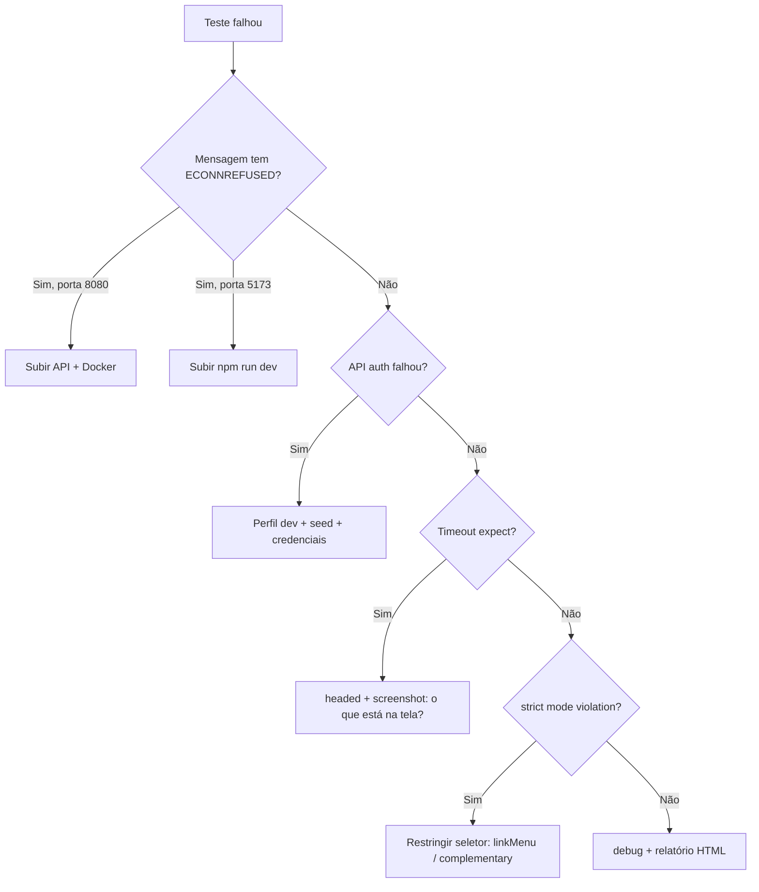

# Dúvidas comuns — erros do Playwright (Farmácia Clark)

Guia para **ler a mensagem de erro** e saber o que fazer. Cada seção segue o mesmo formato:

1. **Como aparece** — trecho típico no terminal  
2. **Tradução** — o que o Playwright está dizendo  
3. **Causa provável** — neste projeto  
4. **O que fazer** — passos práticos  
5. **Como investigar** — ferramentas de debug  

---

## Índice rápido

| # | Erro | Gravidade |
|---|------|-----------|
| 1 | [ECONNREFUSED na API](#1-econnrefused-na-api-1270018080) | Muito comum |
| 2 | [Front não responde (5173)](#2-front-não-responde-localhost5173) | Muito comum |
| 3 | [API auth falhou (401/500)](#3-api-auth-falhou) | Comum |
| 4 | [Timeout no expect](#4-timeout-no-expect-elemento-não-apareceu) | Comum |
| 5 | [Timeout do teste inteiro](#5-timeout-do-teste-inteiro-60s) | Ocasional |
| 6 | [Strict mode violation](#6-strict-mode-violation-2-elementos) | Já resolvido no projeto |
| 7 | [Element not found / not visible](#7-element-not-found--not-visible) | Comum |
| 8 | [toHaveURL falhou](#8-tohaveurl-falhou-redirecionamento-inesperado) | Comum em login |
| 9 | [Target page/browser closed](#9-target-page-context-or-browser-has-been-closed) | Ocasional |
| 10 | [Contas de desenvolvimento](#10-teste-de-contas-de-desenvolvimento-falha) | Ambiente |
| 11 | [Playwright / Chromium não instalado](#11-executable-doesnt-exist--chromium) | Primeira vez |
| 12 | [CI: JAR não encontrado](#12-ci-jar-da-api-não-encontrado) | CI local |
| 13 | [Checklist antes de rodar](#13-checklist-antes-de-rodar-testes) | Preventivo |

---

## 1. ECONNREFUSED na API (`127.0.0.1:8080`)

### Como aparece

```
Error: apiRequestContext.post: connect ECONNREFUSED 127.0.0.1:8080
```

ou

```
API auth falhou: undefined
expect(received).toBeTruthy()
```

### Tradução

O teste tentou fazer **HTTP POST** em `http://127.0.0.1:8080/api/v1/auth/token` e **ninguém escutou** na porta 8080. Não é bug do teste — é **infraestrutura desligada**.

### Causa provável

- API Spring Boot não está rodando  
- Docker (Postgres) parado e a API nem chegou a subir  
- API em outra porta (ex.: 8081)  

### O que fazer

```bash
# Terminal 1 — raiz do repo
docker compose up -d

# Terminal 2 — API em perfil dev
mvn spring-boot:run -pl farmacia-api -am

# Confirme no navegador ou curl:
curl http://127.0.0.1:8080/actuator/health
```

Depois rode os testes de novo:

```bash
cd farmacia-web
npm run test:e2e
```

### Como investigar

- Qual teste falha **primeiro**? Quase sempre `auth.setup.ts` ou `app.spec.ts` (usam `garantirSessaoAdmin`).  
- `login.spec.ts` pode passar parcialmente se só testar UI **sem** chamar API — mas o teste de login com sucesso **precisa** da API.

---

## 2. Front não responde (`localhost:5173`)

### Como aparece

```
Error: page.goto: net::ERR_CONNECTION_REFUSED at http://localhost:5173/login
```

ou

```
page.goto: Timeout 60000ms exceeded
navigating to "http://localhost:5173/login"
```

### Tradução

O navegador do teste não conseguiu abrir o **Vite** (front React).

### Causa provável

- `npm run dev` não está rodando em `farmacia-web`  
- Porta 5173 ocupada por outro processo  
- Firewall bloqueando localhost  

### O que fazer

```bash
cd farmacia-web
npm run dev
```

Abra manualmente: http://localhost:5173/login — se não abrir, o Playwright também não abre.

### Variável de ambiente

Se o front estiver em outra porta:

```powershell
$env:PLAYWRIGHT_BASE_URL="http://localhost:3000"
npm run test:e2e
```

---

## 3. API auth falhou

### Como aparece

```
Error: API auth falhou: 401
```

ou

```
API auth falhou: 500
```

### Tradução

A API **respondeu**, mas o login `POST /api/v1/auth/token` **não deu certo**.

### Causa provável por status

| Status | Significado | O que verificar |
|--------|-------------|-----------------|
| **401** | Credenciais rejeitadas | Email/senha em `credenciais.ts` batem com o seed dev? |
| **403** | Proibido | Perfil errado, CORS, segurança |
| **500** | Erro no servidor | Logs da API; Postgres/RabbitMQ no Docker |
| **503** | Serviço indisponível | API subindo; banco não conectou |

### Credenciais corretas (dev)

```
admin@farmacia.com / admin123
```

Definidas em `e2e/helpers/credenciais.ts` e criadas pelo `DevAmbienteSeed` **somente** com `--spring.profiles.active=dev`.

### O que fazer

1. Confirme perfil **dev**: `mvn spring-boot:run -pl farmacia-api -am` (usa dev por padrão no projeto).  
2. Veja o log da API no terminal no momento do teste.  
3. Teste login manual:

```bash
curl -X POST http://127.0.0.1:8080/api/v1/auth/token ^
  -H "Content-Type: application/json" ^
  -d "{\"email\":\"admin@farmacia.com\",\"senha\":\"admin123\"}"
```

(PowerShell: use `curl.exe` ou `Invoke-RestMethod`.)

---

## 4. Timeout no expect (elemento não apareceu)

### Como aparece

```
Error: expect(locator).toBeVisible()

Locator: getByRole('link', { name: 'Estoque', exact: true })
Expected: visible
Timeout: 10000ms
```

ou (no `autenticar.ts`):

```
expect(linkMenu(page, 'Estoque')).toBeVisible({ timeout: 15_000 })
```

### Tradução

O Playwright **esperou** (10 s padrão, ou 15 s no helper) e o elemento **não ficou visível** na tela.

### Causas prováveis neste projeto

| Situação | Por quê |
|----------|---------|
| Login não “pegou” | Token inválido ou `sessionStorage` vazio → redireciona para `/login` |
| Página ainda carregando | API lenta, primeira requisição pesada |
| Seletor errado | Texto do botão/título mudou no React |
| Usuário não logado | `garantirSessaoAdmin` falhou antes, mas teste continuou |

### O que fazer

1. Rode com navegador visível:

```bash
npm run test:e2e:headed
```

2. No momento da falha, olhe: está na tela de **login** ou no **painel**?  
3. Abra o relatório HTML:

```bash
npm run test:e2e:report
```

Veja **screenshot** e **vídeo** (gerados em falha pela config).

4. Aumente timeout **só temporariamente** para diagnosticar (não é correção definitiva):

```typescript
await expect(algo).toBeVisible({ timeout: 30_000 })
```

### Regra mental

> Timeout no `expect` quase sempre significa: **“o que eu esperava ver na tela não está lá”** — não “o Playwright é lento”.

---

## 5. Timeout do teste inteiro (60s)

### Como aparece

```
Test timeout of 60000ms exceeded
```

### Tradução

O **teste completo** passou de 60 segundos (`timeout: 60_000` em `playwright.config.ts`).

### Causa provável

- API ou front **muito lentos** ou travados  
- `page.goto` esperando página que nunca carrega  
- Loop de espera / deadlock  
- Máquina sobrecarregada  

### O que fazer

1. Verifique se API e Vite respondem rápido no navegador manual.  
2. Rode **um** teste só:

```bash
npx playwright test e2e/login.spec.ts -g "exibe marca"
```

3. Se só falha no CI, pode ser `webServer` demorando para subir o JAR — use `npm run test:e2e:ci` só com JAR já compilado.

---

## 6. Strict mode violation (2+ elementos)

### Como aparece

```
Error: strict mode violation: getByRole('link', { name: 'Estoque' }) resolved to 2 elements
```

### Tradução

O seletor encontrou **mais de um** elemento e o Playwright não sabe em qual clicar.

### Causa neste projeto

No **Painel** existem dois links relacionados a estoque:

- Link **“Estoque”** no menu lateral (`<aside>`)  
- Card **“Estoque FEFO”** no conteúdo principal  

### Solução já aplicada

Use `linkMenu(page, 'Estoque')` em `helpers/navegacao.ts`:

```typescript
page.getByRole('complementary').getByRole('link', { name: nome, exact: true })
```

`complementary` = região do menu lateral apenas.

### Se você escrever um teste novo

| Evite | Prefira |
|-------|---------|
| `getByText('Estoque')` | `linkMenu(page, 'Estoque')` |
| `locator('.sidebar a')` | `getByRole('complementary')` |
| `.first()` sem critério | Escopo claro (menu vs conteúdo) |

---

## 7. Element not found / not visible

### Como aparece

```
Error: locator.click: Error: strict mode violation...
```

ou

```
waiting for getByTestId('login-email')
```

### Tradução

O elemento **não existe** no DOM ou existe mas está **oculto** (CSS, modal fechado, fora da tela).

### Causas comuns

| Erro | Causa |
|------|-------|
| `getByTestId('login-email')` não acha | Não está em `/login`; `data-testid` foi removido do React |
| Botão “Nova entrada” não acha | Não navegou para `/estoque` antes |
| Heading não acha | Título da página mudou no código |

### O que fazer

1. Confirme a **URL** no momento do passo (`page.url()` no debug).  
2. Use **modo debug**:

```bash
npm run test:e2e:debug
```

3. No Inspector: use “Pick locator” para ver o que o Playwright enxerga.

### Diferença importante

- **not found** → elemento não está no HTML  
- **not visible** → está no HTML mas `display:none`, atrás de outro, ou fora do viewport  

---

## 8. toHaveURL falhou (redirecionamento inesperado)

### Como aparece

```
Error: expect(page).toHaveURL(expected)

Expected: "http://localhost:5173/"
Received: "http://localhost:5173/login"
```

### Tradução

Depois do login, o teste esperava ir para `/` (painel), mas **continuou em `/login`**.

### Causa provável

- Credenciais erradas (mas aí outro assert de erro deveria passar)  
- API retornou erro e o front não redirecionou  
- Token não salvo no `sessionStorage`  
- API offline no meio do fluxo  

### No teste de login inválido (comportamento **correto**)

```
Expected: /login
Received: /login  → PASS
```

Se o teste `rejeita credenciais inválidas` falhar em `toHaveURL`, pode ser que o app redirecione para outra rota — aí o **produto** ou o **teste** precisa alinhar.

---

## 9. Target page, context or browser has been closed

### Como aparece

```
Error: page.goto: Target page, context or browser has been closed
Call log:
  - navigating to "http://localhost:5173/login"
```

### Tradução

O navegador ou a aba **foi fechada** antes do `goto` terminar.

### Causa provável

- **Vite caiu** ou reiniciou no meio do teste  
- Processo do Playwright morto (Ctrl+C, IDE encerrou)  
- Crash do Chromium  
- `webServer` do CI matou o processo ao falhar health check  

### O que fazer

1. Deixe `npm run dev` estável em um terminal separado.  
2. Não feche a janela headed manualmente durante o teste.  
3. Rode de novo; se repetir, rode um teste isolado em debug.

---

## 10. Teste de “Contas de desenvolvimento” falha

### Como aparece

```
expect(getByText(/Contas de desenvolvimento/i)).toBeVisible()
Expected: visible
Received: hidden
```

### Tradução

O teste espera os **atalhos de login dev** (botão “Administrador”) que só aparecem quando o Vite está em modo **desenvolvimento**.

### Causa provável

- Front rodando como **build de produção** (`npm run preview` com build prod)  
- Variável `import.meta.env.DEV` é `false`  
- Intencional em produção: atalhos foram removidos por segurança  

### O que fazer

- Para estudos e E2E local: use `npm run dev`, não preview de prod.  
- Se um dia rodar E2E contra staging prod-like, **exclua** ou adapte esse teste no projeto `login`.

---

## 11. Executable doesn't exist — Chromium

### Como aparece

```
browserType.launch: Executable doesn't exist at ...
npx playwright install
```

### Tradução

O navegador Chromium que o Playwright controla **não foi baixado**.

### O que fazer

```bash
cd farmacia-web
npx playwright install chromium
```

Ou após `npm ci`:

```bash
npm ci
npx playwright install --with-deps chromium
```

---

## 12. CI: JAR da API não encontrado

### Como aparece

```
Error: Process from webServer was not able to start
command: java -jar ".../farmacia-api-1.0.0-SNAPSHOT.jar"
```

### Tradução

`npm run test:e2e:ci` tenta subir a API pelo JAR, mas o arquivo **não existe** em `target/`.

### O que fazer

```bash
cd c:\Java\Farmacia
mvn package -pl farmacia-api -am -DskipTests
cd farmacia-web
npm run test:e2e:ci
```

Ou suba API + front manualmente e use `npm run test:e2e` (sem managed servers).

---

## 13. Checklist antes de rodar testes

Use esta lista **na ordem** quando algo falhar e você não souber por onde começar:

```
[ ] Docker: docker compose up -d  (Postgres 5433, RabbitMQ 5672)
[ ] API: mvn spring-boot:run -pl farmacia-api -am
[ ] Health: http://127.0.0.1:8080/actuator/health → UP
[ ] Front: cd farmacia-web && npm run dev
[ ] Login manual: http://localhost:5173/login com admin@farmacia.com / admin123
[ ] Chromium: npx playwright install chromium
[ ] Testes: npm run test:e2e
```

Se tudo acima OK e ainda falhar → `npm run test:e2e:headed` + `npm run test:e2e:report`.

---

## Fluxograma de decisão



---

## Como ler o relatório HTML

1. Rode os testes (mesmo falhando).  
2. `npm run test:e2e:report`  
3. Clique no teste vermelho.  
4. Veja abas: **Errors** (mensagem), **Screenshots**, **Traces** (se houver retry).

Perguntas ao olhar o screenshot:

- Estou na tela que o teste assume?  
- Há mensagem de erro da API na UI?  
- O menu lateral aparece (usuário logado)?  

---

## Erros que **não** são culpa do teste

| Situação | Conclusão |
|----------|-----------|
| API desligada | Infra |
| Senha do seed mudou no Java mas não em `credenciais.ts` | Dados desalinhados |
| Título “Painel operacional” mudou no React | Teste precisa atualizar assert |
| Postgres sem volume / banco vazio | Docker / migração |

| Situação | Pode ser bug **real** no app |
|----------|------------------------------|
| Login válido não redireciona para `/` | Bug front ou API |
| “Nova entrada” não abre formulário | Bug UI |
| Mensagem de erro não aparece com senha errada | Bug UX |

**Teste E2E que falha pode ser:** ambiente, teste desatualizado, **ou** defeito no produto. O screenshot ajuda a distinguir.

---

## Próximo passo

- Terminal simulado: [05-exemplos-terminal-erros.md](./05-exemplos-terminal-erros.md) — veja ❌/✅ lado a lado.  
- Prática: [03-exercicios-praticos.md](./03-exercicios-praticos.md) — exercício 1 pede para parar a API de propósito.  
- Carreira: [06-guia-qa-senior-era-ia.md](./06-guia-qa-senior-era-ia.md).  
- Código do helper de auth: [autenticar.explicado.md](./arquivos/autenticar.explicado.md).  
- Seletores: [navegacao.explicado.md](./arquivos/navegacao.explicado.md).
