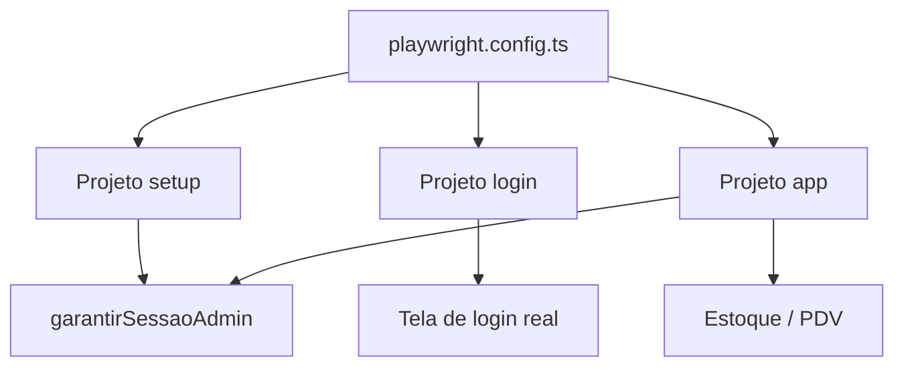
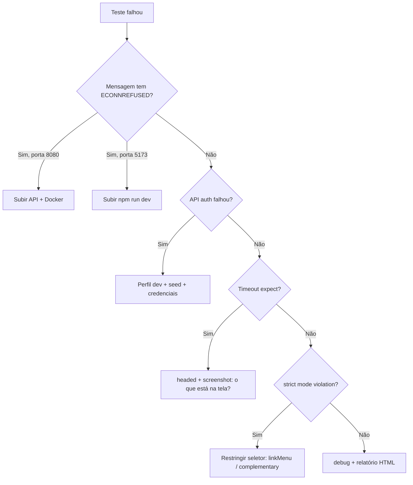

# Guia Completo QA — Farmácia Clark + Carreira Sênior

**Versão consolidada para leitura e impressão offline**  
Projeto: Farmácia Clark (`farmacia-web`) · Playwright · TypeScript · Junho 2026

---

## Como exportar para PDF

| Ferramenta | Passos |
|------------|--------|
| **VS Code / Cursor** | Abra este arquivo → extensão "Markdown PDF" → Export |
| **Pandoc** | `pandoc GUIA-COMPLETO-QA.md -o GUIA-COMPLETO-QA.pdf --toc` |
| **Navegador** | Extensão Markdown Viewer → Imprimir → Salvar como PDF |

**Dica:** ative "quebras de página" entre Partes I–VII no diálogo de impressão.

---

## Índice geral

### Parte I — Introdução
1. [Por onde começar](#parte-i--por-onde-começar)
2. [Glossário](#parte-ii--glossário)
3. [Fluxo dos testes](#parte-iii--fluxo-dos-testes)

### Parte II — Código explicado (linha a linha)
4. [credenciais.ts](#parte-iv--credenciaists)
5. [navegacao.ts](#parte-iv--navegacaots)
6. [autenticar.ts](#parte-iv--autenticarts)
7. [playwright.config.ts](#parte-iv--playwrightconfigts)
8. [auth.setup.ts](#parte-iv--authsetupts)
9. [login.spec.ts](#parte-iv--loginspects)
10. [app.spec.ts](#parte-iv--appspects)

### Parte III — Prática e erros
11. [Exercícios práticos](#parte-v--exercícios-práticos)
12. [Dúvidas comuns — erros](#parte-vi--dúvidas-comuns--erros)
13. [Exemplos de terminal](#parte-vii--exemplos-de-terminal)

### Parte IV — Carreira
14. [QA Sênior na era da IA](#parte-viii--qa-sênior-na-era-da-ia)

### Apêndice
15. [Comandos rápidos](#apêndice--comandos-rápidos)
16. [Mapa de arquivos do projeto](#apêndice--mapa-de-arquivos)

---


---

# Parte I — Por onde começar

# Por onde começar (se testes automatizados te confundem)

## O que é um teste E2E?

**E2E** = *End-to-End* (ponta a ponta).

O Playwright abre um **navegador de verdade** (Chromium), acessa o site da Farmácia Clark como um usuário faria, clica, preenche campos e **verifica** se o resultado está certo.

Não testa só uma função isolada (isso seria teste **unitário** no Java). Testa o **fluxo completo**: front + API + tela.

## As três palavras que você vai ver sempre

| Palavra | Significado simples |
|---------|---------------------|
| **Arrange** (preparar) | Deixar o sistema no estado certo antes do teste (ex.: estar logado) |
| **Act** (agir) | Fazer a ação (clicar, navegar, preencher) |
| **Assert** (verificar) | `expect(...)` — conferir se deu certo |

Exemplo no teste de login:

1. **Arrange:** `beforeEach` abre `/login`  
2. **Act:** preenche email/senha e clica em “Acessar painel”  
3. **Assert:** `expect(page).toHaveURL('/')` — URL mudou para o painel?

## Por que temos vários arquivos?

| Arquivo | Papel | Analogia |
|---------|-------|----------|
| `playwright.config.ts` | Regras da “prova” | Edital do exame: tempo, quantas tentativas, qual navegador |
| `credenciais.ts` | Dados fixos | Gabarito com usuário e senha de teste |
| `autenticar.ts` | Atalho para logar | Entrar na sala antes da prova começar |
| `auth.setup.ts` | Checagem inicial | “A API está ligada?” |
| `login.spec.ts` | Prova da tela de login | Candidato tenta entrar pela porta da frente |
| `app.spec.ts` | Prova já dentro do sistema | Candidato já credenciado visita Estoque e PDV |

## O que NÃO é o Playwright neste projeto

- Não substitui os **51 testes Java** (`mvn test`) — eles testam regras no servidor.  
- Não testa **SNGPC real** nem impressora fiscal.  
- Não precisa da API para ler os arquivos `.md` desta pasta — mas **precisa** para rodar os testes.

## Erro que todo mundo vê no começo

```
ECONNREFUSED 127.0.0.1:8080
```

Tradução: o teste tentou falar com a **API** e ninguém atendeu na porta 8080.

**Solução:** Docker + `mvn spring-boot:run` + `npm run dev` antes de `npm run test:e2e`.

Guia completo com **13 erros típicos** (timeout, strict mode, login, CI…):  
→ [04-duvidas-comuns-erros.md](./04-duvidas-comuns-erros.md)

## Próximo passo

Leia [01-glossario.md](./01-glossario.md) e depois [02-fluxo-dos-testes.md](./02-fluxo-dos-testes.md).  
Quando um teste falhar, consulte [04-duvidas-comuns-erros.md](./04-duvidas-comuns-erros.md).


---

# Parte II — Glossário

# Glossário — QA + Playwright + TypeScript

## Testes

| Termo | Explicação |
|-------|------------|
| **Teste automatizado** | Script que repete verificações sem humano clicando |
| **E2E** | Testa interface + integração como o usuário final |
| **Spec** | Arquivo de especificação de teste (`*.spec.ts`) |
| **Setup** | Preparação antes dos testes principais |
| **Fixture** | Coisa que o Playwright “empresta” ao teste (`page`, `request`) |
| **Locator** | Endereço de um elemento na tela (`getByRole`, `getByTestId`) |
| **Assert / expect** | Afirmação: “eu espero que X seja verdade” |
| **Flaky** | Teste que às vezes passa, às vezes falha (rede lenta, etc.) |
| **Timeout** | Tempo máximo de espera antes de falhar |

## Playwright

| Termo | Explicação |
|-------|------------|
| **page** | Uma aba do navegador controlada pelo teste |
| **request** | Cliente HTTP para chamar API sem abrir tela |
| **baseURL** | Prefixo das URLs (`/login` vira `http://localhost:5173/login`) |
| **project** | Grupo de testes (setup, login, app) |
| **worker** | Processo paralelo que roda testes |
| **headed** | Mostra o navegador na tela |
| **debug** | Modo passo a passo (Inspector) |
| **webServer** | Playwright sobe API/front automaticamente (no CI) |

## TypeScript (só o que aparece nos testes)

| Sintaxe | Explicação |
|---------|------------|
| `import { x } from 'y'` | Traz função/variável de outro arquivo |
| `export` | Deixa outro arquivo importar |
| `async` / `await` | Espera operação terminar (rede, navegação) |
| `const` | Constante — não muda depois |
| `??` | Se esquerda for `null`/`undefined`, usa direita |
| `as const` | Objeto readonly, valores fixos |
| `as { token: string }` | Diz ao TypeScript o formato do JSON |
| `type Page` | Só tipo, some na compilação |
| `/regex/i` | Texto com padrão flexível, `i` = ignora maiúsculas |

## Farmácia Clark (domínio)

| Termo | Explicação |
|-------|------------|
| **JWT / token** | “Crachá digital” após login |
| **sessionStorage** | Armazenamento no navegador enquanto a aba está aberta |
| **Seed dev** | Usuários criados automaticamente no perfil `dev` da API |
| **ADMIN** | Usuário `admin@farmacia.com` / `admin123` |

## Seletores usados aqui (boa prática)

| Método | Quando usar |
|--------|-------------|
| `getByTestId('login-email')` | Campos críticos com `data-testid` no React |
| `getByRole('button', { name: '...' })` | Botões e links como usuário enxerga |
| `getByRole('heading', { name: /.../ })` | Títulos de página |
| `getByPlaceholder(/.../)` | Campo de busca |
| `getByRole('complementary')` | Região lateral (`<aside>`) |


---

# Parte III — Fluxo dos testes

# Fluxo completo — o que acontece quando você roda `npm run test:e2e`

## Passo a passo

```
1. Você executa: npm run test:e2e
2. Playwright lê playwright.config.ts
3. Descobre 3 projetos: setup → login + app (app depende de setup)
4. Abre o Chromium (Desktop Chrome)
5. RODA setup (auth.setup.ts)
6. RODA login.spec.ts (4 testes)
7. RODA app.spec.ts (4 testes) — cada um chama garantirSessaoAdmin no beforeEach
8. Mostra relatório: passed / failed
```

Total: **9 testes** (1 setup + 4 login + 4 app).

## Diagrama

```
┌─────────────────────────────────────────────────────────┐
│                  playwright.config.ts                      │
│  baseURL, timeout, projetos, reporters, webServer (CI)    │
└──────────────────────────┬──────────────────────────────┘
                           │
         ┌─────────────────┼─────────────────┐
         ▼                 ▼                 ▼
    ┌─────────┐     ┌───────────┐     ┌───────────┐
    │  setup  │     │   login   │     │    app    │
    │ 1 teste │     │ 4 testes  │     │ 4 testes  │
    └────┬────┘     └───────────┘     └─────┬─────┘
         │                                  │
         │         auth.setup.ts            │  beforeEach
         │              │                   │      │
         └──────────────┴───────────────────┴──────┘
                           │
                    autenticar.ts
                     /          \
              request (API)    page (browser)
```

## Projeto `setup` — o que valida?

- API responde em `POST /api/v1/auth/token`  
- Token entra no `sessionStorage`  
- Após ir para `/`, o link **Estoque** no menu aparece  

Se falhar, o projeto `app` **nem deveria** ser confiável — por isso `dependencies: ['setup']`.

## Projeto `login` — o que valida?

Testa a **experiência de login na UI**, sem usar `autenticar.ts`:

| Teste | Objetivo QA |
|-------|-------------|
| Marca e formulário | Tela carregou? Campos existem? |
| Credenciais inválidas | Sistema barra usuário errado? |
| Admin autentica | Fluxo feliz pela tela |
| Atalhos dev | Só em modo desenvolvimento Vite |

## Projeto `app` — o que valida?

Usuário **já logado** (via `garantirSessaoAdmin`):

| Teste | Objetivo QA |
|-------|-------------|
| Sidebar | Marca Farmácia + Clark + menu |
| Estoque listagem | Título, busca, botão Nova entrada |
| Nova entrada | Formulário abre com regra de validade |
| PDV | Tela “Nova venda” carrega |

## CI (GitHub Actions)

No servidor de integração:

- Sobe Postgres e RabbitMQ  
- Compila o JAR da API  
- `PLAYWRIGHT_MANAGED_SERVERS=1` → Playwright sobe API + `npm run dev`  
- Roda os 9 testes com `workers: 1` e `retries: 2`  

## Quando um teste falha, olhe nesta ordem

1. API ligada? (`http://127.0.0.1:8080/actuator/health`)  
2. Front ligado? (`http://localhost:5173`)  
3. Docker com Postgres?  
4. Screenshot em `test-results/`  
5. Relatório HTML: `npm run test:e2e:report`  


---

# Parte IV — credenciais.ts

# credenciais.ts — linha por linha

**Arquivo real:** `e2e/helpers/credenciais.ts`  
**Função:** Centralizar dados que os testes usam (usuário, senha, chaves do navegador).

---

## Código completo

```typescript
/** Credenciais do seed dev (`DevAmbienteSeed`) — só válidas com API em perfil `dev`. */
export const ADMIN = {
  email: 'admin@farmacia.com',
  senha: 'admin123',
} as const

export const FARMACIA_NOME_COMPLETO = 'Farmácia Clark'

/** Chaves alinhadas a `farmacia-web/src/lib/auth.ts` (sessão no navegador). */
export const TOKEN_KEY = 'farmacia_token'
export const TOKEN_EXPIRES_KEY = 'farmacia_token_expires'
```

---

## Linha por linha

| Linha | Código | O que faz |
|-------|--------|-----------|
| 1 | Comentário `/** ... */` | Documentação: estes dados vêm do seed Java `DevAmbienteSeed`, só no perfil `dev`. |
| 2 | `export const ADMIN = {` | Cria objeto **exportado** chamado `ADMIN` para importar em outros arquivos. |
| 3 | `email: 'admin@farmacia.com'` | E-mail do administrador de desenvolvimento. |
| 4 | `senha: 'admin123'` | Senha correspondente (nunca use em produção real). |
| 5 | `} as const` | TypeScript: valores **fixos** e imutáveis — evita alterar sem querer. |
| 6 | (linha vazia) | Separação visual. |
| 7 | `export const FARMACIA_NOME_COMPLETO = ...` | Nome da marca para asserts na tela de login. |
| 8 | (linha vazia) | — |
| 9 | Comentário | Explica que as chaves abaixo são iguais às de `src/lib/auth.ts`. |
| 10 | `TOKEN_KEY = 'farmacia_token'` | Nome da chave no `sessionStorage` onde o JWT fica guardado. |
| 11 | `TOKEN_EXPIRES_KEY = ...` | Chave onde guardamos **quando** o token expira (timestamp). |

---

## Por que este arquivo existe? (QA)

- **Um lugar só** para mudar usuário/senha se o seed mudar.  
- **Rastreabilidade:** teste ↔ seed Java ↔ tela de login.  
- **Evita “número mágico”** espalhado em 5 arquivos.

---

## Perguntas de estudo

1. O que acontece se a API rodar em perfil `prod` sem esse usuário?  
2. Por que `TOKEN_KEY` precisa ser igual ao do `auth.ts`?


---

# Parte IV — navegacao.ts

# navegacao.ts — linha por linha

**Arquivo real:** `e2e/helpers/navegacao.ts`  
**Função:** Achar links do **menu lateral** sem confundir com outros links da página.

---

## Código completo

```typescript
import type { Page } from '@playwright/test'

/** Link do menu lateral (evita ambiguidade com cards do painel). */
export function linkMenu(page: Page, nome: string) {
  return page.getByRole('complementary').getByRole('link', { name: nome, exact: true })
}
```

---

## Linha por linha

| Linha | Código | O que faz |
|-------|--------|-----------|
| 1 | `import type { Page } from '@playwright/test'` | Importa só o **tipo** `Page` (aba do navegador). Não gera código JavaScript extra. |
| 2 | (vazia) | — |
| 3 | Comentário | Explica o problema que resolve: dois links “Estoque” na mesma página. |
| 4 | `export function linkMenu(page, nome)` | Função reutilizável: recebe a página e o texto do menu (ex.: `'Estoque'`). |
| 5 | `getByRole('complementary')` | Restringe busca à região **complementar** — no HTML é o `<aside>` (barra lateral). |
| 5 | `.getByRole('link', { name: nome, exact: true })` | Dentro do aside, acha link com nome **exato** (não “Estoque FEFO” do card). |

---

## O problema real (caso de estudo)

No **Painel**, existe:

- Link **Estoque** no menu (sidebar)  
- Card com texto **“Estoque FEFO”** que também leva a `/estoque`  

`page.getByRole('link', { name: 'Estoque' })` → Playwright acha **2 elementos** → erro *strict mode violation*.

`linkMenu(page, 'Estoque')` → só o do menu.

---

## Boas práticas QA

| Ruim | Melhor |
|------|--------|
| `page.locator('.sidebar a:nth-child(4)')` | Quebra se CSS mudar |
| `getByText('Estoque')` | Pega card e menu |
| `getByRole('complementary').getByRole('link', ...)` | Semântica de acessibilidade |


---

# Parte IV — autenticar.ts

# autenticar.ts — linha por linha

**Arquivo real:** `e2e/helpers/autenticar.ts`  
**Função:** Deixar o navegador **logado como admin** antes dos testes do `app.spec.ts`.

---

## Código completo

```typescript
import { expect, type APIRequestContext, type Page } from '@playwright/test'
import { ADMIN, TOKEN_EXPIRES_KEY, TOKEN_KEY } from './credenciais'
import { linkMenu } from './navegacao'

const apiBase = process.env.PLAYWRIGHT_API_URL ?? 'http://127.0.0.1:8080'

/** Garante JWT no sessionStorage (API + injeção — estável para E2E). */
export async function garantirSessaoAdmin(page: Page, request: APIRequestContext) {
  const res = await request.post(`${apiBase}/api/v1/auth/token`, {
    data: { email: ADMIN.email, senha: ADMIN.senha },
  })
  expect(res.ok(), `API auth falhou: ${res.status()}`).toBeTruthy()

  const body = (await res.json()) as { token: string; expiraEmSegundos: number }

  await page.goto('/login')
  await page.evaluate(
    ({ token, expiraEmSegundos, tokenKey, expiresKey }) => {
      sessionStorage.setItem(tokenKey, token)
      sessionStorage.setItem(
        expiresKey,
        String(Date.now() + expiraEmSegundos * 1000),
      )
    },
    {
      token: body.token,
      expiraEmSegundos: body.expiraEmSegundos,
      tokenKey: TOKEN_KEY,
      expiresKey: TOKEN_EXPIRES_KEY,
    },
  )

  await page.goto('/')
  await expect(linkMenu(page, 'Estoque')).toBeVisible({ timeout: 15_000 })
}
```

---

## Linha por linha

| Linha | O que faz |
|-------|-----------|
| **1** | Importa `expect` (verificações) e tipos `Page` (navegador) e `APIRequestContext` (HTTP). |
| **2** | Importa usuário, senha e nomes das chaves do `sessionStorage`. |
| **3** | Importa helper do menu lateral. |
| **4** | (vazia) |
| **5** | URL da API: variável de ambiente ou padrão `127.0.0.1:8080` (evita problema IPv6 no Windows). |
| **6** | (vazia) |
| **7** | Comentário JSDoc: propósito da função. |
| **8** | Declara função **assíncrona** exportada; recebe `page` e `request` do Playwright. |
| **9–11** | **POST** na API de login com email/senha do `ADMIN`. |
| **12** | Assert: status HTTP deve ser 2xx; senão mensagem com código de erro. |
| **13** | (vazia) |
| **14** | Lê JSON da resposta; TypeScript espera `token` e `expiraEmSegundos`. |
| **15** | (vazia) |
| **16** | Abre `/login` no front para estar na **mesma origem** (domínio/porta) antes do storage. |
| **17–31** | `page.evaluate`: executa código **dentro do navegador** para gravar token e expiração no `sessionStorage` (igual `saveToken` do app). |
| **32** | (vazia) |
| **33** | Navega para o painel `/`. |
| **34** | Confirma que o login “pegou”: link Estoque visível em até 15 segundos. |

---

## Por que login pela API e não pelo botão?

| Login pela tela | Login pela API (`autenticar.ts`) |
|-----------------|----------------------------------|
| Testa o fluxo visual | Prepara estado rapidamente |
| Mais lento | Mais estável |
| Usado em `login.spec.ts` | Usado em `app.spec.ts` |

**Separação de responsabilidades:** um arquivo testa login; outro testa estoque/PDV.

---

## `page.evaluate` em detalhe

- Código da **função** (linhas 18–23) roda no **browser**.  
- Objeto da **linha 25–30** é copiado do Node para o browser (tem que ser JSON-serializável).  
- Por isso passamos `tokenKey` e `expiresKey` como strings, não importamos constantes dentro do browser.

---

## Exercício

Reescreva em português o fluxo em 5 bullets, como se explicasse para um colega de QA.


---

# Parte IV — playwright.config.ts

# playwright.config.ts — linha por linha

**Arquivo real:** `farmacia-web/playwright.config.ts`  
**Função:** “Central de comando” — diz ao Playwright **onde** estão os testes, **como** rodar e **o que** subir antes.

---

## Imports e caminhos (linhas 1–13)

| Linha | Código | Explicação |
|-------|--------|------------|
| 1 | `import { defineConfig, devices } from '@playwright/test'` | `defineConfig` monta a config; `devices` traz perfis de navegador (Chrome, Firefox…). |
| 2 | `import path from 'path'` | Utilitário Node para juntar pastas (`join`, `resolve`). |
| 3 | `import { fileURLToPath } from 'url'` | Em projetos ES modules, converte URL do arquivo em caminho no disco. |
| 4 | (vazia) | — |
| 5 | `const __dirname = path.dirname(fileURLToPath(import.meta.url))` | Descobre a pasta onde está este `.ts` (equivalente ao `__dirname` antigo). |
| 6 | `const repoRoot = path.resolve(__dirname, '..')` | Sobe um nível: de `farmacia-web` para a raiz do monorepo. |
| 7 | (vazia) | — |
| 8 | `baseURL = process.env.PLAYWRIGHT_BASE_URL ?? 'http://localhost:5173'` | URL do front (Vite). `??` = usa env se existir, senão padrão. |
| 9 | `apiBase = ... 'http://127.0.0.1:8080'` | URL da API Spring. `127.0.0.1` evita `ECONNREFUSED` com `localhost` no Windows. |
| 10 | `apiHealthUrl = ... /actuator/health` | Endpoint que o Playwright consulta para saber se a API já subiu. |
| 11 | `managedServers = CI === 'true' \|\| PLAYWRIGHT_MANAGED_SERVERS === '1'` | Se `true`, o Playwright **liga** API + Vite sozinho. Localmente você costuma subir manualmente. |
| 12 | (vazia) | — |
| 13 | `apiJar = path.join(repoRoot, 'farmacia-api', 'target', ...)` | Caminho do JAR compilado da API (usado no CI). |

---

## Bloco `defineConfig` (linhas 15–68)

| Linha | Opção | O que significa para QA |
|-------|-------|-------------------------|
| 15 | `export default defineConfig({` | Exporta a config que o CLI do Playwright lê. |
| 16 | `testDir: './e2e'` | Todos os `*.spec.ts` e `auth.setup.ts` ficam em `e2e/`. |
| 17 | `fullyParallel: true` | Testes **diferentes** podem rodar em paralelo (mais rápido). |
| 18 | `forbidOnly: !!process.env.CI` | No CI, falha se alguém deixou `test.only` (evita pular testes no pipeline). |
| 19 | `retries: CI ? 2 : 0` | No CI, repete até 2 vezes teste que falhou (flaky). Local: zero retry. |
| 20 | `workers: CI ? 1 : undefined` | No CI, 1 worker (menos concorrência). Local: padrão do Playwright. |
| 21 | `timeout: 60_000` | Cada teste tem até **60 segundos** para terminar. |
| 22 | `expect: { timeout: 10_000 }` | Cada `expect(...)` espera até **10 s** antes de falhar. |
| 23–26 | `reporter` | `list` = texto no terminal; `html` = relatório em `playwright-report/`. |
| 27–32 | `use: { ... }` | Padrão para **todos** os projetos: `baseURL`, trace, screenshot, vídeo. |
| 28 | `baseURL` | `page.goto('/login')` vira `http://localhost:5173/login`. |
| 29 | `trace: 'on-first-retry'` | Grava trace só na 2ª tentativa (útil para debug no CI). |
| 30 | `screenshot: 'only-on-failure'` | Print só quando o teste quebra. |
| 31 | `video: 'retain-on-failure'` | Vídeo só em falha (economiza disco). |

---

## Projetos (linhas 33–49)

Playwright divide os testes em **projetos** (como “suites” com regras diferentes):

| Projeto | `testMatch` | Dependências | Papel |
|---------|-------------|--------------|-------|
| **setup** | `auth.setup.ts` | — | Roda primeiro: valida API + sessão |
| **login** | `login.spec.ts` | — | Testes da tela de login (independente) |
| **app** | `app.spec.ts` | `setup` | Só roda **depois** do setup passar |

| Linha | Detalhe |
|-------|---------|
| 41 | `devices['Desktop Chrome']` | Emula Chrome desktop (viewport padrão). |
| 46 | `dependencies: ['setup']` | Se setup falhar, `app` nem executa — economiza tempo e deixa o erro claro. |

---

## `webServer` (linhas 50–67)

Só existe quando `managedServers` é `true`:

| Servidor | Comando | URL de espera |
|----------|---------|-----------------|
| API | `java -jar ... --spring.profiles.active=dev` | `actuator/health` |
| Front | `npm run dev` | `baseURL` (5173) |

| Opção | Significado |
|-------|-------------|
| `timeout: 180_000` (API) | Até 3 min para o JAR subir (Maven build pode ser lento). |
| `reuseExistingServer: !CI` | Local: se API/Vite já estão rodando, **reusa** em vez de subir de novo. |
| `undefined` (sem managed) | Você sobe Docker/API/Vite manualmente — comum no dia a dia. |

---

## Diagrama



---

## Perguntas frequentes

**Por que três projetos e não um só?**  
Login precisa rodar **sem** estar logado. App precisa **estar** logado. Setup garante que a infra está OK antes do `app`.

**O que é `baseURL`?**  
Atalho: você escreve `/estoque` e o Playwright completa com `http://localhost:5173/estoque`.

**Por que meu teste falha com ECONNREFUSED?**  
API ou Vite não estão no ar — ou `PLAYWRIGHT_API_URL` aponta para porta errada.


---

# Parte IV — auth.setup.ts

# auth.setup.ts — linha por linha

**Arquivo real:** `farmacia-web/e2e/auth.setup.ts`  
**Função:** **Pré-condição** — um “teste zero” que confirma: API responde, login funciona, front aceita sessão.

---

## Código completo

```typescript
import { test as setup } from '@playwright/test'
import { garantirSessaoAdmin } from './helpers/autenticar'

/** Valida que API + front permitem autenticação antes dos testes autenticados. */
setup('pré-condição: API e sessão admin', async ({ page, request }) => {
  await garantirSessaoAdmin(page, request)
})
```

---

## Linha por linha

| Linha | Código | Explicação |
|-------|--------|------------|
| 1 | `import { test as setup } from '@playwright/test'` | Importa `test` mas renomeia para `setup`. **Motivo:** no relatório HTML aparece como projeto “setup”, não mistura com `login`/`app`. |
| 2 | `import { garantirSessaoAdmin } from './helpers/autenticar'` | Reutiliza a mesma função que o `app.spec.ts` usa no `beforeEach`. |
| 3 | (vazia) | — |
| 4 | Comentário | Documenta o propósito: gate antes dos testes autenticados. |
| 5 | `setup('pré-condição: ...', async ({ page, request }) => {` | Define **um** teste com nome legível em português. Recebe `page` (navegador) e `request` (cliente HTTP). |
| 6 | `await garantirSessaoAdmin(page, request)` | Executa login via API + injeção no `sessionStorage` + verifica menu Estoque. |
| 7 | `})` | Fim do teste. |

---

## Por que existe se `app.spec.ts` já faz login no `beforeEach`?

| Papel | `auth.setup.ts` | `beforeEach` do `app.spec.ts` |
|-------|-----------------|-------------------------------|
| Quando roda | **Uma vez** no início do projeto `app` | **Antes de cada** teste do `app` |
| Objetivo | Falhar cedo se API/front quebraram | Garantir sessão fresca em cada caso |
| Dependência | `app` **não roda** se falhar | Cada teste repete o fluxo |

Pense no setup como **“a porta da sala de aula”**: se a porta está trancada (API off), não adianta entrar em cada prova (`app`).

---

## Ligação com `playwright.config.ts`

```typescript
{
  name: 'setup',
  testMatch: /auth\.setup\.ts/,
},
{
  name: 'app',
  testMatch: /app\.spec\.ts/,
  dependencies: ['setup'],  // ← só roda app se setup passou
}
```

---

## O que você aprende aqui (QA)

1. **Pré-condições** não testam feature — testam **ambiente**.  
2. **Renomear `test` → `setup`** é convenção para organizar relatórios.  
3. **DRY:** uma função (`garantirSessaoAdmin`) serve setup + beforeEach.

---

## Exercício

Se a API estiver parada, qual mensagem de erro você espera ver primeiro: no `setup` ou no 3º teste do `app`? Por quê?


---

# Parte IV — login.spec.ts

# login.spec.ts — linha por linha

**Arquivo real:** `farmacia-web/e2e/login.spec.ts`  
**Função:** Testar a **tela de login** como um usuário faria — sem atalho de API.

**4 testes** no projeto `login` (não depende do `auth.setup.ts`).

---

## Estrutura geral

```typescript
import → describe → beforeEach → 4 testes
```

---

## Linhas 1–7 — preparação

| Linha | Código | Explicação |
|-------|--------|------------|
| 1 | `import { test, expect } from '@playwright/test'` | `test` = define casos; `expect` = asserções (verificações). |
| 2 | `import { ADMIN, FARMACIA_NOME_COMPLETO } from './helpers/credenciais'` | Dados centralizados (email, senha, nome da marca). |
| 3 | (vazia) | — |
| 4 | `test.describe('Login — Farmácia Clark', () => {` | Agrupa testes no relatório sob o título “Login — Farmácia Clark”. |
| 5 | `test.beforeEach(async ({ page }) => {` | **Antes de cada teste**, roda este bloco. |
| 6 | `await page.goto('/login')` | Abre a página de login (usa `baseURL` da config → `http://localhost:5173/login`). |
| 7 | `})` | Fim do `beforeEach`. |

**Por que `beforeEach`?** Os 4 testes começam na tela de login — evita repetir `goto` em cada um.

---

## Teste 1 — `exibe marca e formulário de acesso` (linhas 9–16)

| Linha | Código | O que verifica |
|-------|--------|----------------|
| 9 | `test('exibe marca...', async ({ page }) => {` | Nome do caso no relatório. |
| 10 | `expect(page).toHaveTitle(/Farmácia Clark/i)` | Aba do navegador contém “Farmácia Clark” (`i` = ignora maiúsculas). |
| 11 | `getByText(FARMACIA_NOME_COMPLETO).first()` | Texto da marca visível (`.first()` se houver mais de um no DOM). |
| 12 | `getByRole('heading', { name: /Entrar no sistema/i })` | Título H1/H2 “Entrar no sistema”. |
| 13 | `getByTestId('login-email')` | Campo e-mail — `data-testid` colocado no React para testes estáveis. |
| 14 | `getByTestId('login-senha')` | Campo senha. |
| 15 | `getByTestId('login-submit')` | Botão enviar. |
| 16 | `.toBeEnabled()` | Botão não está desabilitado. |

**Tipo de teste:** smoke / UI — “a página carregou o essencial?”

---

## Teste 2 — `rejeita credenciais inválidas` (linhas 18–25)

| Linha | Código | O que faz |
|-------|--------|-----------|
| 18 | Início do teste | — |
| 19 | `.fill('invalido@farmacia.com')` | Digita e-mail que **não** existe no seed. |
| 20 | `.fill('senha-errada')` | Senha incorreta. |
| 21 | `.click()` no submit | Envia o formulário. |
| 22 | (vazia) | — |
| 23 | `toHaveURL(/\/login/)` | **Continua** na URL de login (não redirecionou para `/`). |
| 24 | `getByText(/credenciais\|inválid\|erro/i).first()` | Mensagem de erro visível (regex aceita variações de texto). |
| 24 | `timeout: 15_000` | Espera até 15 s (API pode demorar na 1ª requisição). |

**Tipo de teste:** negativo — comportamento quando login **falha**.

---

## Teste 3 — `admin dev autentica e abre o painel` (linhas 27–34)

| Linha | Código | O que faz |
|-------|--------|-----------|
| 28–29 | `fill(ADMIN.email)` e `fill(ADMIN.senha)` | Credenciais do seed dev. |
| 30 | `click()` submit | Login real pela UI. |
| 32 | `toHaveURL('/')` | Redirecionou para o painel principal. |
| 33 | `heading ... /Painel operacional/i` | Título do dashboard visível. |

**Tipo de teste:** caminho feliz — login **com sucesso** ponta a ponta (front + API).

---

## Teste 4 — `com Vite em modo dev exibe atalhos...` (linhas 36–39)

| Linha | Código | O que faz |
|-------|--------|-----------|
| 37 | `getByText(/Contas de desenvolvimento/i)` | Bloco de dicas só aparece em **dev** (`import.meta.env.DEV`). |
| 38 | `getByRole('button', { name: 'Administrador' })` | Botão que preenche conta admin com um clique. |

**Tipo de teste:** ambiente dev — em build de produção este teste **pode falhar** se os atalhos forem removidos (comportamento esperado).

---

## Mapa dos 4 testes

```
beforeEach → /login
    │
    ├─ Teste 1: elementos visíveis?
    ├─ Teste 2: login errado → erro + fica em /login
    ├─ Teste 3: login certo → vai para /
    └─ Teste 4: atalhos dev visíveis?
```

---

## Seletores usados (resumo)

| Método | Quando usar |
|--------|-------------|
| `getByTestId` | IDs estáveis no código (`login-email`) |
| `getByRole` | Botões, headings — alinhado a acessibilidade |
| `getByText` | Texto visível na tela |
| `toHaveTitle` / `toHaveURL` | Estado da página / navegação |

---

## Diferença vs `app.spec.ts`

| | `login.spec.ts` | `app.spec.ts` |
|--|-----------------|---------------|
| Login | Pelo **formulário** | Pela **API** (`garantirSessaoAdmin`) |
| Foco | Tela de acesso | Estoque, PDV, menu |
| Setup | Não usa `auth.setup` | Depende do `setup` |

**Regra de ouro:** teste o que você quer validar. Login visual → `login.spec`. Funcionalidade logada → `app.spec` + helper de API.


---

# Parte IV — app.spec.ts

# app.spec.ts — linha por linha

**Arquivo real:** `farmacia-web/e2e/app.spec.ts`  
**Função:** Testar o sistema **já autenticado** — menu, estoque, entrada de mercadoria, PDV.

**4 testes** no projeto `app` (depende de `auth.setup.ts` ter passado).

---

## Linhas 1–9 — imports e login automático

| Linha | Código | Explicação |
|-------|--------|------------|
| 1 | `import { test, expect } from '@playwright/test'` | Ferramentas base do Playwright. |
| 2 | `import { garantirSessaoAdmin } from './helpers/autenticar'` | Função que loga via API + `sessionStorage`. |
| 3 | `import { FARMACIA_NOME_COMPLETO } from './helpers/credenciais'` | Nome da marca para asserts. |
| 4 | `import { linkMenu } from './helpers/navegacao'` | Helper para links do menu lateral. |
| 5 | (vazia) | — |
| 6 | `test.describe('App autenticado', () => {` | Grupo no relatório. |
| 7 | `test.beforeEach(async ({ page, request }) => {` | Antes de **cada** teste: precisa de `page` **e** `request` (HTTP). |
| 8 | `await garantirSessaoAdmin(page, request)` | Garante JWT válido e painel carregado. |
| 9 | `})` | Fim do hook. |

**Diferença do login.spec:** aqui o `beforeEach` **não** vai para `/login` para digitar senha — usa atalho estável pela API.

---

## Teste 1 — `sidebar exibe marca Farmácia Clark` (linhas 10–15)

| Linha | Código | Explicação |
|-------|--------|------------|
| 10 | `test('sidebar exibe marca...', async ({ page }) => {` | Caso: identidade visual no menu. |
| 11 | `const menu = page.getByRole('complementary')` | Região `<aside>` — barra lateral. |
| 12 | `FARMACIA_NOME_COMPLETO.split(' ')[0]` | Pega primeira palavra: **"Farmácia"**. |
| 12 | `menu.getByText(...).toBeVisible()` | “Farmácia” aparece no menu. |
| 13 | `menu.getByText('Clark')` | Segunda parte da marca. |
| 14 | `linkMenu(page, 'Estoque')` | Link do menu (não o card do painel). |
| 14 | `.toBeVisible()` | Confirma que usuário logado vê navegação principal. |

**O que valida:** sessão ativa + layout do shell (AppShell) com menu.

---

## Teste 2 — `navega para estoque e exibe listagem` (linhas 17–22)

| Linha | Código | Explicação |
|-------|--------|------------|
| 17 | Início do teste | — |
| 18 | `page.goto('/estoque')` | Navega direto para rota de estoque (SPA React). |
| 19 | `heading ... /Estoque & FEFO/i` | Título da página de estoque. |
| 20 | `button ... /Nova entrada/i` | Botão para abrir fluxo de entrada. |
| 21 | `getByPlaceholder(/Buscar medicamento/i)` | Campo de busca na listagem. |

**O que valida:** rota `/estoque` renderiza componentes principais.

---

## Teste 3 — `abre formulário de nova entrada de mercadoria` (linhas 24–29)

| Linha | Código | Explicação |
|-------|--------|------------|
| 24 | Início | — |
| 25 | `goto('/estoque')` | Mesmo ponto de partida. |
| 26 | `getByRole('button', { name: /Nova entrada/i }).click()` | **Ação** do usuário: clica no botão. |
| 27 | `heading ... /Entrada de mercadoria/i` | Painel/modal de entrada abriu. |
| 28 | `getByText(/Somente hoje ou datas futuras/i)` | Regra de validade (datas passadas bloqueadas) visível na UI. |

**O que valida:** interação — clique abre formulário + texto de regra de negócio.

**Padrão Arrange–Act–Assert:**

1. **Arrange:** `goto` estoque (já logado pelo beforeEach)  
2. **Act:** clique em Nova entrada  
3. **Assert:** heading + mensagem de validade  

---

## Teste 4 — `navega para PDV` (linhas 31–34)

| Linha | Código | Explicação |
|-------|--------|------------|
| 31 | Início | — |
| 32 | `page.goto('/vendas')` | Rota do ponto de venda. |
| 33 | `heading ... /Nova venda/i` | Título da tela de vendas. |

**O que valida:** módulo PDV carrega para usuário autenticado.

---

## Visão geral dos 4 testes

```
beforeEach → garantirSessaoAdmin (API + sessionStorage + /)
    │
    ├─ Teste 1: sidebar (marca + link Estoque)
    ├─ Teste 2: /estoque (listagem)
    ├─ Teste 3: /estoque → Nova entrada (formulário)
    └─ Teste 4: /vendas (PDV)
```

---

## Por que não testamos “vender um item” aqui?

Estes são testes **E2E de fumaça** (smoke): provam que rotas críticas **abrem** sem erro.  
Um teste completo de venda exigiria: produto em estoque, carrinho, pagamento, estoque decrementado — mais longo e frágil. Bom próximo passo quando você evoluir em QA.

---

## Checklist mental ao ler este arquivo

- [ ] Entendo que `request` é o cliente HTTP do Playwright (não é o `fetch` do browser).  
- [ ] Entendo que `goto('/estoque')` usa URL relativa por causa do `baseURL`.  
- [ ] Sei por que `linkMenu` evita ambiguidade no teste 1.  
- [ ] Sei a diferença entre teste que só **olha** a tela e teste que **clica** (teste 3).


---

# Parte V — Exercícios práticos

# Exercícios práticos — Playwright Farmácia Clark

Use estes exercícios depois de ler os arquivos em `arquivos/*.explicado.md`.

---

## Nível 1 — Entender o que roda

1. Rode `npm run test:e2e:headed` e observe a **ordem**: setup → login (4) → app (4).
2. Pare a API e rode de novo. Qual projeto falha primeiro? Anote a mensagem.
3. Abra `playwright-report/index.html` após uma falha e localize screenshot + vídeo.

---

## Nível 2 — Ler código

1. No `login.spec.ts`, qual linha prova que o usuário **não** entrou no sistema?
2. No `autenticar.ts`, por que abrimos `/login` antes do `sessionStorage`?
3. Explique em uma frase a diferença entre `page` e `request`.

---

## Nível 3 — Pequenas mudanças (no `e2e/` real, não na pasta de estudo)

1. Adicione um teste em `login.spec.ts` que verifica se o campo senha tem `type="password"`.
2. Em `app.spec.ts`, após abrir Nova entrada, verifique se existe um campo com label ou placeholder de medicamento.
3. Troque temporariamente `ADMIN.senha` para `'errada'` em `credenciais.ts` — qual teste quebra? Por quê?

---

## Nível 4 — Debug

1. Rode `npm run test:e2e:debug` no teste `admin dev autentica e abre o painel`.
2. Use o Inspector para pausar **depois** do click no submit.
3. Anote a URL e um elemento visível nesse momento.

---

## Gabarito rápido (Nível 2)

| Pergunta | Resposta curta |
|----------|----------------|
| Login inválido não entra | Linha 23: `toHaveURL(/\/login/)` |
| Por que `/login` antes do storage | Mesma origem (protocolo + host + porta) para o `sessionStorage` |
| `page` vs `request` | `page` = navegador; `request` = HTTP direto à API sem UI |

---

## Quando estiver confuso

Volte sempre a este fluxo mental:

```
Config → Setup (ambiente OK?) → Login (tela) → App (logado) → Helpers (peças reutilizáveis)
```

Se travar em um `expect`, pergunte: **o que eu esperava ver na tela e o que o teste está procurando?**

Se aparecer mensagem vermelha no terminal, abra o índice em [04-duvidas-comuns-erros.md](./04-duvidas-comuns-erros.md).


---

# Parte VI — Dúvidas comuns — erros

# Dúvidas comuns — erros do Playwright (Farmácia Clark)

Guia para **ler a mensagem de erro** e saber o que fazer. Cada seção segue o mesmo formato:

1. **Como aparece** — trecho típico no terminal  
2. **Tradução** — o que o Playwright está dizendo  
3. **Causa provável** — neste projeto  
4. **O que fazer** — passos práticos  
5. **Como investigar** — ferramentas de debug  

---

## Índice rápido

| # | Erro | Gravidade |
|---|------|-----------|
| 1 | [ECONNREFUSED na API](#1-econnrefused-na-api-1270018080) | Muito comum |
| 2 | [Front não responde (5173)](#2-front-não-responde-localhost5173) | Muito comum |
| 3 | [API auth falhou (401/500)](#3-api-auth-falhou) | Comum |
| 4 | [Timeout no expect](#4-timeout-no-expect-elemento-não-apareceu) | Comum |
| 5 | [Timeout do teste inteiro](#5-timeout-do-teste-inteiro-60s) | Ocasional |
| 6 | [Strict mode violation](#6-strict-mode-violation-2-elementos) | Já resolvido no projeto |
| 7 | [Element not found / not visible](#7-element-not-found--not-visible) | Comum |
| 8 | [toHaveURL falhou](#8-tohaveurl-falhou-redirecionamento-inesperado) | Comum em login |
| 9 | [Target page/browser closed](#9-target-page-context-or-browser-has-been-closed) | Ocasional |
| 10 | [Contas de desenvolvimento](#10-teste-de-contas-de-desenvolvimento-falha) | Ambiente |
| 11 | [Playwright / Chromium não instalado](#11-executable-doesnt-exist--chromium) | Primeira vez |
| 12 | [CI: JAR não encontrado](#12-ci-jar-da-api-não-encontrado) | CI local |
| 13 | [Checklist antes de rodar](#13-checklist-antes-de-rodar-testes) | Preventivo |

---

## 1. ECONNREFUSED na API (`127.0.0.1:8080`)

### Como aparece

```
Error: apiRequestContext.post: connect ECONNREFUSED 127.0.0.1:8080
```

ou

```
API auth falhou: undefined
expect(received).toBeTruthy()
```

### Tradução

O teste tentou fazer **HTTP POST** em `http://127.0.0.1:8080/api/v1/auth/token` e **ninguém escutou** na porta 8080. Não é bug do teste — é **infraestrutura desligada**.

### Causa provável

- API Spring Boot não está rodando  
- Docker (Postgres) parado e a API nem chegou a subir  
- API em outra porta (ex.: 8081)  

### O que fazer

```bash
# Terminal 1 — raiz do repo
docker compose up -d

# Terminal 2 — API em perfil dev
mvn spring-boot:run -pl farmacia-api -am

# Confirme no navegador ou curl:
curl http://127.0.0.1:8080/actuator/health
```

Depois rode os testes de novo:

```bash
cd farmacia-web
npm run test:e2e
```

### Como investigar

- Qual teste falha **primeiro**? Quase sempre `auth.setup.ts` ou `app.spec.ts` (usam `garantirSessaoAdmin`).  
- `login.spec.ts` pode passar parcialmente se só testar UI **sem** chamar API — mas o teste de login com sucesso **precisa** da API.

---

## 2. Front não responde (`localhost:5173`)

### Como aparece

```
Error: page.goto: net::ERR_CONNECTION_REFUSED at http://localhost:5173/login
```

ou

```
page.goto: Timeout 60000ms exceeded
navigating to "http://localhost:5173/login"
```

### Tradução

O navegador do teste não conseguiu abrir o **Vite** (front React).

### Causa provável

- `npm run dev` não está rodando em `farmacia-web`  
- Porta 5173 ocupada por outro processo  
- Firewall bloqueando localhost  

### O que fazer

```bash
cd farmacia-web
npm run dev
```

Abra manualmente: http://localhost:5173/login — se não abrir, o Playwright também não abre.

### Variável de ambiente

Se o front estiver em outra porta:

```powershell
$env:PLAYWRIGHT_BASE_URL="http://localhost:3000"
npm run test:e2e
```

---

## 3. API auth falhou

### Como aparece

```
Error: API auth falhou: 401
```

ou

```
API auth falhou: 500
```

### Tradução

A API **respondeu**, mas o login `POST /api/v1/auth/token` **não deu certo**.

### Causa provável por status

| Status | Significado | O que verificar |
|--------|-------------|-----------------|
| **401** | Credenciais rejeitadas | Email/senha em `credenciais.ts` batem com o seed dev? |
| **403** | Proibido | Perfil errado, CORS, segurança |
| **500** | Erro no servidor | Logs da API; Postgres/RabbitMQ no Docker |
| **503** | Serviço indisponível | API subindo; banco não conectou |

### Credenciais corretas (dev)

```
admin@farmacia.com / admin123
```

Definidas em `e2e/helpers/credenciais.ts` e criadas pelo `DevAmbienteSeed` **somente** com `--spring.profiles.active=dev`.

### O que fazer

1. Confirme perfil **dev**: `mvn spring-boot:run -pl farmacia-api -am` (usa dev por padrão no projeto).  
2. Veja o log da API no terminal no momento do teste.  
3. Teste login manual:

```bash
curl -X POST http://127.0.0.1:8080/api/v1/auth/token ^
  -H "Content-Type: application/json" ^
  -d "{\"email\":\"admin@farmacia.com\",\"senha\":\"admin123\"}"
```

(PowerShell: use `curl.exe` ou `Invoke-RestMethod`.)

---

## 4. Timeout no expect (elemento não apareceu)

### Como aparece

```
Error: expect(locator).toBeVisible()

Locator: getByRole('link', { name: 'Estoque', exact: true })
Expected: visible
Timeout: 10000ms
```

ou (no `autenticar.ts`):

```
expect(linkMenu(page, 'Estoque')).toBeVisible({ timeout: 15_000 })
```

### Tradução

O Playwright **esperou** (10 s padrão, ou 15 s no helper) e o elemento **não ficou visível** na tela.

### Causas prováveis neste projeto

| Situação | Por quê |
|----------|---------|
| Login não “pegou” | Token inválido ou `sessionStorage` vazio → redireciona para `/login` |
| Página ainda carregando | API lenta, primeira requisição pesada |
| Seletor errado | Texto do botão/título mudou no React |
| Usuário não logado | `garantirSessaoAdmin` falhou antes, mas teste continuou |

### O que fazer

1. Rode com navegador visível:

```bash
npm run test:e2e:headed
```

2. No momento da falha, olhe: está na tela de **login** ou no **painel**?  
3. Abra o relatório HTML:

```bash
npm run test:e2e:report
```

Veja **screenshot** e **vídeo** (gerados em falha pela config).

4. Aumente timeout **só temporariamente** para diagnosticar (não é correção definitiva):

```typescript
await expect(algo).toBeVisible({ timeout: 30_000 })
```

### Regra mental

> Timeout no `expect` quase sempre significa: **“o que eu esperava ver na tela não está lá”** — não “o Playwright é lento”.

---

## 5. Timeout do teste inteiro (60s)

### Como aparece

```
Test timeout of 60000ms exceeded
```

### Tradução

O **teste completo** passou de 60 segundos (`timeout: 60_000` em `playwright.config.ts`).

### Causa provável

- API ou front **muito lentos** ou travados  
- `page.goto` esperando página que nunca carrega  
- Loop de espera / deadlock  
- Máquina sobrecarregada  

### O que fazer

1. Verifique se API e Vite respondem rápido no navegador manual.  
2. Rode **um** teste só:

```bash
npx playwright test e2e/login.spec.ts -g "exibe marca"
```

3. Se só falha no CI, pode ser `webServer` demorando para subir o JAR — use `npm run test:e2e:ci` só com JAR já compilado.

---

## 6. Strict mode violation (2+ elementos)

### Como aparece

```
Error: strict mode violation: getByRole('link', { name: 'Estoque' }) resolved to 2 elements
```

### Tradução

O seletor encontrou **mais de um** elemento e o Playwright não sabe em qual clicar.

### Causa neste projeto

No **Painel** existem dois links relacionados a estoque:

- Link **“Estoque”** no menu lateral (`<aside>`)  
- Card **“Estoque FEFO”** no conteúdo principal  

### Solução já aplicada

Use `linkMenu(page, 'Estoque')` em `helpers/navegacao.ts`:

```typescript
page.getByRole('complementary').getByRole('link', { name: nome, exact: true })
```

`complementary` = região do menu lateral apenas.

### Se você escrever um teste novo

| Evite | Prefira |
|-------|---------|
| `getByText('Estoque')` | `linkMenu(page, 'Estoque')` |
| `locator('.sidebar a')` | `getByRole('complementary')` |
| `.first()` sem critério | Escopo claro (menu vs conteúdo) |

---

## 7. Element not found / not visible

### Como aparece

```
Error: locator.click: Error: strict mode violation...
```

ou

```
waiting for getByTestId('login-email')
```

### Tradução

O elemento **não existe** no DOM ou existe mas está **oculto** (CSS, modal fechado, fora da tela).

### Causas comuns

| Erro | Causa |
|------|-------|
| `getByTestId('login-email')` não acha | Não está em `/login`; `data-testid` foi removido do React |
| Botão “Nova entrada” não acha | Não navegou para `/estoque` antes |
| Heading não acha | Título da página mudou no código |

### O que fazer

1. Confirme a **URL** no momento do passo (`page.url()` no debug).  
2. Use **modo debug**:

```bash
npm run test:e2e:debug
```

3. No Inspector: use “Pick locator” para ver o que o Playwright enxerga.

### Diferença importante

- **not found** → elemento não está no HTML  
- **not visible** → está no HTML mas `display:none`, atrás de outro, ou fora do viewport  

---

## 8. toHaveURL falhou (redirecionamento inesperado)

### Como aparece

```
Error: expect(page).toHaveURL(expected)

Expected: "http://localhost:5173/"
Received: "http://localhost:5173/login"
```

### Tradução

Depois do login, o teste esperava ir para `/` (painel), mas **continuou em `/login`**.

### Causa provável

- Credenciais erradas (mas aí outro assert de erro deveria passar)  
- API retornou erro e o front não redirecionou  
- Token não salvo no `sessionStorage`  
- API offline no meio do fluxo  

### No teste de login inválido (comportamento **correto**)

```
Expected: /login
Received: /login  → PASS
```

Se o teste `rejeita credenciais inválidas` falhar em `toHaveURL`, pode ser que o app redirecione para outra rota — aí o **produto** ou o **teste** precisa alinhar.

---

## 9. Target page, context or browser has been closed

### Como aparece

```
Error: page.goto: Target page, context or browser has been closed
Call log:
  - navigating to "http://localhost:5173/login"
```

### Tradução

O navegador ou a aba **foi fechada** antes do `goto` terminar.

### Causa provável

- **Vite caiu** ou reiniciou no meio do teste  
- Processo do Playwright morto (Ctrl+C, IDE encerrou)  
- Crash do Chromium  
- `webServer` do CI matou o processo ao falhar health check  

### O que fazer

1. Deixe `npm run dev` estável em um terminal separado.  
2. Não feche a janela headed manualmente durante o teste.  
3. Rode de novo; se repetir, rode um teste isolado em debug.

---

## 10. Teste de “Contas de desenvolvimento” falha

### Como aparece

```
expect(getByText(/Contas de desenvolvimento/i)).toBeVisible()
Expected: visible
Received: hidden
```

### Tradução

O teste espera os **atalhos de login dev** (botão “Administrador”) que só aparecem quando o Vite está em modo **desenvolvimento**.

### Causa provável

- Front rodando como **build de produção** (`npm run preview` com build prod)  
- Variável `import.meta.env.DEV` é `false`  
- Intencional em produção: atalhos foram removidos por segurança  

### O que fazer

- Para estudos e E2E local: use `npm run dev`, não preview de prod.  
- Se um dia rodar E2E contra staging prod-like, **exclua** ou adapte esse teste no projeto `login`.

---

## 11. Executable doesn't exist — Chromium

### Como aparece

```
browserType.launch: Executable doesn't exist at ...
npx playwright install
```

### Tradução

O navegador Chromium que o Playwright controla **não foi baixado**.

### O que fazer

```bash
cd farmacia-web
npx playwright install chromium
```

Ou após `npm ci`:

```bash
npm ci
npx playwright install --with-deps chromium
```

---

## 12. CI: JAR da API não encontrado

### Como aparece

```
Error: Process from webServer was not able to start
command: java -jar ".../farmacia-api-1.0.0-SNAPSHOT.jar"
```

### Tradução

`npm run test:e2e:ci` tenta subir a API pelo JAR, mas o arquivo **não existe** em `target/`.

### O que fazer

```bash
cd c:\Java\Farmacia
mvn package -pl farmacia-api -am -DskipTests
cd farmacia-web
npm run test:e2e:ci
```

Ou suba API + front manualmente e use `npm run test:e2e` (sem managed servers).

---

## 13. Checklist antes de rodar testes

Use esta lista **na ordem** quando algo falhar e você não souber por onde começar:

```
[ ] Docker: docker compose up -d  (Postgres 5433, RabbitMQ 5672)
[ ] API: mvn spring-boot:run -pl farmacia-api -am
[ ] Health: http://127.0.0.1:8080/actuator/health → UP
[ ] Front: cd farmacia-web && npm run dev
[ ] Login manual: http://localhost:5173/login com admin@farmacia.com / admin123
[ ] Chromium: npx playwright install chromium
[ ] Testes: npm run test:e2e
```

Se tudo acima OK e ainda falhar → `npm run test:e2e:headed` + `npm run test:e2e:report`.

---

## Fluxograma de decisão



---

## Como ler o relatório HTML

1. Rode os testes (mesmo falhando).  
2. `npm run test:e2e:report`  
3. Clique no teste vermelho.  
4. Veja abas: **Errors** (mensagem), **Screenshots**, **Traces** (se houver retry).

Perguntas ao olhar o screenshot:

- Estou na tela que o teste assume?  
- Há mensagem de erro da API na UI?  
- O menu lateral aparece (usuário logado)?  

---

## Erros que **não** são culpa do teste

| Situação | Conclusão |
|----------|-----------|
| API desligada | Infra |
| Senha do seed mudou no Java mas não em `credenciais.ts` | Dados desalinhados |
| Título “Painel operacional” mudou no React | Teste precisa atualizar assert |
| Postgres sem volume / banco vazio | Docker / migração |

| Situação | Pode ser bug **real** no app |
|----------|------------------------------|
| Login válido não redireciona para `/` | Bug front ou API |
| “Nova entrada” não abre formulário | Bug UI |
| Mensagem de erro não aparece com senha errada | Bug UX |

**Teste E2E que falha pode ser:** ambiente, teste desatualizado, **ou** defeito no produto. O screenshot ajuda a distinguir.

---

## Próximo passo

- Terminal simulado: [05-exemplos-terminal-erros.md](./05-exemplos-terminal-erros.md) — veja ❌/✅ lado a lado.  
- Prática: [03-exercicios-praticos.md](./03-exercicios-praticos.md) — exercício 1 pede para parar a API de propósito.  
- Carreira: [06-guia-qa-senior-era-ia.md](./06-guia-qa-senior-era-ia.md).  
- Código do helper de auth: [autenticar.explicado.md](./arquivos/autenticar.explicado.md).  
- Seletores: [navegacao.explicado.md](./arquivos/navegacao.explicado.md).


---

# Parte VII — Exemplos de terminal

# Exemplos de terminal — antes e depois de corrigir

Simulações **fieis ao que você vê no PowerShell** ao rodar `npm run test:e2e` no Farmácia Clark.  
Use para treinar o olho: **qual linha importa** e **qual é a primeira causa**.

---

## Como ler estes exemplos

| Símbolo | Significado |
|---------|-------------|
| ❌ **ANTES** | Terminal quando algo está errado |
| ✅ **DEPOIS** | Terminal quando o ambiente está correto |
| `→` | Ação que você deve tomar |

Relacionado: [04-duvidas-comuns-erros.md](./04-duvidas-comuns-erros.md)

---

## 1. API desligada (ECONNREFUSED :8080)

### ❌ ANTES — API não está rodando

```text
PS C:\Java\Farmacia\farmacia-web> npm run test:e2e

> farmacia-web@0.0.0 test:e2e
> playwright test

Running 9 tests using 4 workers

  ✘  1 [setup] › e2e\auth.setup.ts:5:1 › pré-condição: API e sessão admin (312ms)
  ✘  2 [login] › e2e\login.spec.ts:27:3 › admin dev autentica e abre o painel (1.2s)

  1) [setup] › e2e\auth.setup.ts:5:1 › pré-condição: API e sessão admin

    Error: apiRequestContext.post: connect ECONNREFUSED 127.0.0.1:8080

       at helpers\autenticar.ts:9

       7 | /** Garante JWT no sessionStorage (API + injeção — estável para E2E). */
       8 | export async function garantirSessaoAdmin(page: Page, request: APIRequestContext) {
    >  9 |   const res = await request.post(`${apiBase}/api/v1/auth/token`, {
         |                             ^
      10 |     data: { email: ADMIN.email, senha: ADMIN.senha },
      11 |   })
      12 |   expect(res.ok(), `API auth falhou: ${res.status()}`).toBeTruthy()

  2) [login] › login.spec.ts:27:3 › admin dev autentica e abre o painel

    Error: expect(page).toHaveURL(expected)

    Expected: "http://localhost:5173/"
    Received: "http://localhost:5173/login"

  2 failed
  7 did not run
```

**Linha que importa:** `ECONNREFUSED 127.0.0.1:8080` na linha 9 de `autenticar.ts`.  
**Efeito dominó:** `setup` falha → `app` nem roda (`7 did not run`). Login com sucesso também falha porque a API não autentica.

→ Subir Docker + API:

```bash
docker compose up -d
mvn spring-boot:run -pl farmacia-api -am
```

---

### ✅ DEPOIS — API no ar

```text
PS C:\Java\Farmacia\farmacia-web> npm run test:e2e

Running 9 tests using 4 workers

  ✓  1 [setup] › e2e\auth.setup.ts:5:1 › pré-condição: API e sessão admin (2.1s)
  ✓  2 [login] › e2e\login.spec.ts:9:3 › exibe marca e formulário de acesso (890ms)
  ✓  3 [login] › e2e\login.spec.ts:18:3 › rejeita credenciais inválidas (1.4s)
  ✓  4 [login] › e2e\login.spec.ts:27:3 › admin dev autentica e abre o painel (1.8s)
  ✓  5 [login] › e2e\login.spec.ts:36:3 › com Vite em modo dev exibe atalhos... (412ms)
  ✓  6 [app] › e2e\app.spec.ts:10:3 › sidebar exibe marca Farmácia Clark (1.1s)
  ✓  7 [app] › e2e\app.spec.ts:17:3 › navega para estoque e exibe listagem (956ms)
  ✓  8 [app] › e2e\app.spec.ts:24:3 › abre formulário de nova entrada... (1.2s)
  ✓  9 [app] › e2e\app.spec.ts:31:3 › navega para PDV (743ms)

  9 passed (12.4s)
```

---

## 2. Front desligado (Vite :5173)

### ❌ ANTES — só API rodando, sem `npm run dev`

```text
  ✘  1 [setup] › e2e\auth.setup.ts:5:1 › pré-condição: API e sessão admin (8.2s)

    Error: page.goto: net::ERR_CONNECTION_REFUSED at http://localhost:5173/login
    Call log:
      - navigating to "http://localhost:5173/login", waiting until "load"

       at helpers\autenticar.ts:16

      14 |   const body = (await res.json()) as { token: string; expiraEmSegundos: number }
      15 |
    > 16 |   await page.goto('/login')
         |              ^
      17 |   await page.evaluate(
```

**Linha que importa:** `ERR_CONNECTION_REFUSED` em `page.goto('/login')`.  
**Detalhe:** o POST na API **pode ter funcionado** (linha 9 passou); o erro vem **depois**, ao abrir o front.

→ Em outro terminal:

```bash
cd farmacia-web
npm run dev
```

---

### ✅ DEPOIS

```text
  VITE v6.x.x  ready in 420 ms

  ➜  Local:   http://localhost:5173/
  ➜  press h + enter to show help
```

Com Vite assim, o `page.goto('/login')` completa e o setup segue.

---

## 3. Credenciais erradas ou perfil sem seed (401)

### ❌ ANTES — senha trocada em `credenciais.ts` por engano

```text
  ✘  1 [setup] › e2e\auth.setup.ts:5:1 › pré-condição: API e sessão admin (156ms)

    Error: API auth falhou: 401

    expect(received).toBeTruthy()

    Received: false

       at helpers\autenticar.ts:12

      10 |     data: { email: ADMIN.email, senha: ADMIN.senha },
      11 |   })
    > 12 |   expect(res.ok(), `API auth falhou: ${res.status()}`).toBeTruthy()
         |                                                        ^
```

**Linha que importa:** `API auth falhou: 401` — a API **respondeu**, mas rejeitou login.  
**Não é** ECONNREFUSED.

→ Conferir `e2e/helpers/credenciais.ts` = `admin@farmacia.com` / `admin123` e API em perfil **dev**.

---

### ✅ DEPOIS — curl confirma antes dos testes

```text
PS C:\Java\Farmacia> curl.exe -s -o NUL -w "%{http_code}" ^
  -X POST http://127.0.0.1:8080/api/v1/auth/token ^
  -H "Content-Type: application/json" ^
  -d "{\"email\":\"admin@farmacia.com\",\"senha\":\"admin123\"}"

200
```

`200` → credenciais OK → testes de auth devem passar.

---

## 4. Timeout — menu Estoque não aparece (sessão inválida)

### ❌ ANTES — token não injetado / usuário na tela de login

```text
  ✘  1 [app] › e2e\app.spec.ts:10:3 › sidebar exibe marca Farmácia Clark (16.8s)

    Error: expect(locator).toBeVisible()

    Locator: getByRole('complementary').getByRole('link', { name: 'Estoque', exact: true })
    Expected: visible
    Timeout: 15000ms
    Error: element(s) not found

       at helpers\autenticar.ts:34

      32 |
      33 |   await page.goto('/')
    > 34 |   await expect(linkMenu(page, 'Estoque')).toBeVisible({ timeout: 15_000 })
         |                                           ^
```

**Screenshot no relatório mostraria:** tela de **login**, não o painel.  
**Tradução:** o teste esperava menu lateral logado; a aplicação mandou para `/login`.

→ Rodar headed e ver onde para:

```bash
npm run test:e2e:headed -g "sidebar exibe marca"
```

---

### ✅ DEPOIS — mesma linha, teste passa em ~1s

```text
  ✓  6 [app] › e2e\app.spec.ts:10:3 › sidebar exibe marca Farmácia Clark (1.1s)
```

Quando passa rápido, o `garantirSessaoAdmin` funcionou de primeira.

---

## 5. Strict mode violation (dois links “Estoque”)

### ❌ ANTES — seletor amplo (erro clássico de quem está aprendendo)

```text
  ✘  1 [app] › e2e\app.spec.ts:10:3 › sidebar exibe marca Farmácia Clark (412ms)

    Error: strict mode violation: getByRole('link', { name: 'Estoque' }) resolved to 2 elements:
        1) <a href="/estoque" ...>Estoque</a> aka getByRole('complementary').getByRole('link', { name: 'Estoque' })
        2) <a href="/estoque" ...>Estoque FEFO</a> aka getByRole('link', { name: 'Estoque FEFO' })

    Call log:
      - waiting for getByRole('link', { name: 'Estoque' })
```

**Linha que importa:** `resolved to 2 elements` — Playwright achou **dois** links.  
**Correção no projeto:** `linkMenu(page, 'Estoque')` restringe ao `<aside>`.

---

### ✅ DEPOIS — com `linkMenu()`

```text
  ✓  6 [app] › e2e\app.spec.ts:10:3 › sidebar exibe marca Farmácia Clark (1.1s)
```

Nenhuma mensagem de strict mode — um único elemento encontrado.

---

## 6. Login inválido — teste passando vs falhando

### ✅ CORRETO — credenciais erradas, fica em `/login`

```text
  ✓  3 [login] › e2e\login.spec.ts:18:3 › rejeita credenciais inválidas (1.4s)
```

Nenhum erro — o assert `toHaveURL(/\/login/)` bate com a realidade.

---

### ❌ ERRADO — app redireciona para rota inesperada (hipotético)

```text
  ✘  3 [login] › e2e\login.spec.ts:18:3 › rejeita credenciais inválidas (890ms)

    Error: expect(page).toHaveURL(expected)

    Expected pattern: /\/login/
    Received string:  "http://localhost:5173/erro"
```

**Interpretação:** o **produto mudou** (nova página de erro) ou há **bug** de navegação. O teste precisa alinhar com o comportamento esperado do negócio — não é só “consertar o teste”.

---

## 7. Browser fechado no meio do fluxo

### ❌ ANTES — Vite reiniciou ou janela headed fechada

```text
  ✘  1 [setup] › e2e\auth.setup.ts:5:1 › pré-condição: API e sessão admin (4.1s)

    Error: page.goto: Target page, context or browser has been closed
    Call log:
      - navigating to "http://localhost:5173/login", waiting until "load"

       at helpers\autenticar.ts:16

    > 16 |   await page.goto('/login')
```

**Diferença do erro 2:** aqui a porta **pode** estar aberta; o processo do navegador **morreu** durante o `goto`.

→ Não feche o Chromium manualmente em headed; mantenha `npm run dev` estável.

---

## 8. Atalhos “Contas de desenvolvimento” (só dev)

### ❌ ANTES — front em preview de produção

```text
  ✘  5 [login] › e2e\login.spec.ts:36:3 › com Vite em modo dev exibe atalhos... (10.8s)

    Error: expect(locator).toBeVisible()

    Locator: getByText(/Contas de desenvolvimento/i)
    Expected: visible
    Timeout: 10000ms
```

**Screenshot:** login normal, **sem** bloco de atalhos — esperado em build prod.

→ Use `npm run dev`, não `npm run preview` com build de produção.

---

### ✅ DEPOIS — `npm run dev`

```text
  ✓  5 [login] › e2e\login.spec.ts:36:3 › com Vite em modo dev exibe atalhos... (412ms)
```

---

## 9. Chromium não instalado

### ❌ ANTES — primeira execução sem `playwright install`

```text
PS C:\Java\Farmacia\farmacia-web> npm run test:e2e

Running 9 tests using 4 workers

  ✘  1 [setup] › e2e\auth.setup.ts:5:1 › pré-condição: API e sessão admin (2ms)

    Error: browserType.launch: Executable doesn't exist at
    C:\Users\LENOVO\AppData\Local\ms-playwright\chromium-1148\chrome-win\chrome.exe

    ╔════════════════════════════════════════════════════════════╗
    ║ Looks like Playwright was just installed or updated.       ║
    ║ Please run:                                                ║
    ║   npx playwright install                                   ║
    ╚════════════════════════════════════════════════════════════╝
```

**Linha que importa:** caixa com `npx playwright install` — siga exatamente isso.

---

### ✅ DEPOIS

```text
PS C:\Java\Farmacia\farmacia-web> npx playwright install chromium

Downloading Chromium 131.0.6778.33 - 162.3 Mb [====================] 100%
Chromium 131.0.6778.33 downloaded to ...
```

---

## 10. CI local — JAR inexistente

### ❌ ANTES — `test:e2e:ci` sem compilar API

```text
PS C:\Java\Farmacia\farmacia-web> npm run test:e2e:ci

Error: Process from webServer was not able to start. Exit code: 1

  Command: java -jar "C:\Java\Farmacia\farmacia-api\target\farmacia-api-1.0.0-SNAPSHOT.jar" --spring.profiles.active=dev

  Error: Unable to access jarfile C:\Java\Farmacia\farmacia-api\target\farmacia-api-1.0.0-SNAPSHOT.jar
```

→ Compilar antes:

```bash
cd C:\Java\Farmacia
mvn package -pl farmacia-api -am -DskipTests
```

---

### ✅ DEPOIS — webServer sobe API e front

```text
[WebServer] Started java -jar ...
[WebServer] Started npm run dev
Running 9 tests using 1 worker

  9 passed (45.2s)
```

No CI, `workers: 1` — mais lento, mais estável.

---

## Tabela resumo — primeira linha a procurar

| Se você vê isto… | Provável causa | Primeira ação |
|------------------|----------------|---------------|
| `ECONNREFUSED 127.0.0.1:8080` | API off | `mvn spring-boot:run` + Docker |
| `ERR_CONNECTION_REFUSED ...5173` | Vite off | `npm run dev` |
| `API auth falhou: 401` | Credenciais/seed | `credenciais.ts` + perfil dev |
| `Timeout: 15000ms` + Estoque | Não logado | headed + screenshot |
| `strict mode violation` + 2 elements | Seletor amplo | `linkMenu()` / `complementary` |
| `Executable doesn't exist` | Browser | `npx playwright install chromium` |
| `Unable to access jarfile` | CI sem build | `mvn package` |
| `7 did not run` | Setup falhou | Corrigir o **primeiro** teste vermelho |

---

## Exercício

1. Copie o bloco **❌ ANTES** do erro 1 e circule mentalmente: arquivo, linha, mensagem raiz.  
2. Suba só o front (sem API) e veja se seu terminal parece com o erro 1 ou 2.  
3. Abra `playwright-report` após uma falha real e compare com o que você esperava neste documento.

Próximo: [06-guia-qa-senior-era-ia.md](./06-guia-qa-senior-era-ia.md)


---

# Parte VIII — QA Sênior na era da IA

# O que um QA Sênior precisa saber hoje — com IA no mercado

Documento de referência para **carreira**, não só para o Farmácia Clark.  
Atualizado para o contexto de **2025–2026**: IA generativa em todo lugar, mas qualidade de software continua sendo problema humano + sistêmico.

---

## A pergunta certa

Não é: *“A IA vai substituir QA?”*  
É: ***“O que sobra para um sênior quando a IA faz o trabalho repetitivo?”***

Resposta curta: **julgamento de risco, desenho de estratégia, profundidade investigativa, influência no produto e garantia de que o que foi automatizado testa a coisa certa.**

---

## O que a IA já faz bem (e você deve usar)

| Tarefa | Como usar sem virar dependente |
|--------|--------------------------------|
| Gerar casos de teste iniciais | Revisar, cortar 70%, adicionar regras de negócio reais |
| Esboçar scripts Playwright/Cypress | Validar seletores, estabilidade, manutenção |
| Explicar logs e stack traces | Confirmar na evidência (reproduzir você mesmo) |
| Documentar bugs e relatórios | Editar tom, impacto, prioridade para o negócio |
| Dados de teste sintéticos | Nunca dados reais de cliente; validar LGPD |
| Resumir PRs e diffs | Ler o diff crítico manualmente |
| Converter requisitos em checklist | Questionar ambiguidades com PO/dev |

**Regra de ouro:** IA é **estagiário rápido** — produz volume; o sênior produz **confiança**.

---

## O que a IA faz mal (seu diferencial)

- Saber **o que não testar** por custo vs risco  
- Entender **impacto no usuário farmacêutico** (ou banco, saúde, varejo)  
- Detectar que o teste passa mas o **produto está errado** (falso positivo)  
- Negociar prazo com PM quando cobertura é ilusória  
- Perceber **flaky** que esconde bug intermitente  
- Auditar se automação cobre **caminho crítico de receita/compliance**  
- Cultura de qualidade: post-mortem, blameless, métricas honestas  

---

## Mapa de competências — QA Sênior moderno

### Nível 1 — Fundação (não negociável)

Você precisa dominar na prática, não só no currículo:

| Área | O que “saber” significa |
|------|-------------------------|
| **Test design** | Partição de equivalência, valores limite, tabelas de decisão, fluxos alternativos |
| **Pirâmide de testes** | Unitário (dev) + integração + E2E enxuto; saber por que E2E é caro |
| **API testing** | REST, status HTTP, JSON, auth JWT, contratos; Postman/Insomnia + testes automatizados |
| **SQL básico-intermediário** | Validar dados após ação; investigar bug em fila/estoque/pedido |
| **Git + PR** | Ler diff, comentar risco, reproduzir branch do dev |
| **HTTP e navegador** | Cookies, storage, CORS, cache — essencial para bugs “só em prod” |
| **Escrita de bug** | Passos mínimos, esperado vs atual, ambiente, severidade vs prioridade |

Sem isso, você vira “executor de ferramenta” que a IA substitui primeiro.

---

### Nível 2 — Automação com critério (diferencial forte)

| Tema | Sênior faz assim |
|------|------------------|
| **Por que automatizar** | ROI: regressão frequente, release rápido, dados críticos |
| **O que não automatizar** | UI instável, terceiros, hardware, impressora fiscal |
| **Seletores** | `data-testid`, roles ARIA — não XPath frágil |
| **Page Object / helpers** | Como `autenticar.ts` e `linkMenu()` neste projeto |
| **CI** | Pipeline falha = bloqueio real ou ruído? Ajustar flakes |
| **Paralelismo e isolamento** | Testes independentes, dados próprios, sem ordem fixa |
| **Relatórios** | Screenshot, trace, vídeo — evidência para o time |

Ferramentas: Playwright (web), Rest Assured/Karate (API Java), pytest (se Python). **A ferramenta muda; os princípios não.**

---

### Nível 3 — Sistema e engenharia (o que separa pleno de sênior)

| Tema | Por que importa |
|------|----------------|
| **Arquitetura do produto** | Monolito, microserviços, filas (RabbitMQ), cache — onde o bug mora |
| **Observabilidade** | Logs, métricas, tracing; correlacionar erro de UI com API |
| **Ambientes** | dev / staging / prod; paridade; feature flags |
| **Containers** | Docker, compose — reproduzir bug “só na pipeline” |
| **Segurança básica** | OWASP Top 10, auth, injection, dados sensíveis em teste |
| **Performance smoke** | k6/JMeter leve — não precisa ser perf engineer, mas detectar regressão grosseira |
| **Contratos** | Consumer-driven ou OpenAPI — quebra de API antes do front |

Sênior **não precisa programar como dev staff**, mas **lê código** nas áreas que testa e conversa com dev em igualdade.

---

### Nível 4 — Estratégia e liderança (marca de sênior de verdade)

| Responsabilidade | Entregável |
|------------------|------------|
| **Test plan por risco** | Matriz: impacto × probabilidade × mitigação |
| **Release readiness** | Go/no-go com evidência, não “achismo” |
| **Métricas úteis** | Escape rate, MTTR de bug, tempo de feedback CI — não vanity % cobertura |
| **Mentoria** | Pleno/júnior escrevem testes melhores por sua revisão |
| **Shift-left** | Critérios de aceite testáveis antes do código |
| **Shift-right** | Monitoramento pós-deploy, canary, rollback |
| **Comunicação** | Traduzir risco técnico para PO/negócio em linguagem de impacto |

---

## Pirâmide revisada na era da IA

```text
                    ┌─────────────────────┐
                    │  Exploratório humano │  ← IA não substitui intuição
                    │  + charter + sessões │
                    ├─────────────────────┤
                    │  E2E crítico (pouco) │  ← Playwright: login, $, compliance
                    ├─────────────────────┤
                    │  API / integração    │  ← Maior ROI de automação
                    ├─────────────────────┤
                    │  Unitário (dev)      │  ← Regras de negócio puras
                    └─────────────────────┘
         IA acelera a base da pirâmide ──────────────► você desenha o topo
```

**Erro comum em 2026:** gerar 500 testes E2E com ChatGPT, pipeline de 2 horas, ninguém confia.

**Sênior:** menos testes, mais **significativos**, alinhados ao risco.

---

## Habilidades humanas que valem mais com IA

1. **Pensamento crítico** — “Este teste prova o quê?”  
2. **Curiosidade** — reproduzir antes de abrir ticket  
3. **Comunicação escrita** — bug claro economiza dias  
4. **Empatia com usuário** — farmácia, idoso, operador sob pressão  
5. **Negociação** — “não dá para testar tudo em 2 dias” com alternativas  
6. **Ética** — dados fake, não vazar PHI/PII em prompt de IA  
7. **Aprendizado contínuo** — ferramenta nova a cada 2 anos; princípios estáveis  

---

## O que estudar em 2026 (prioridade prática)

### Curto prazo (3–6 meses)

- [ ] Playwright ou Cypress até automação estável (você já começou aqui)  
- [ ] Testes de API no seu stack (Spring: Rest Assured ou testes `@WebMvcTest` / Testcontainers)  
- [ ] SQL para validação de dados  
- [ ] CI: GitHub Actions ou GitLab — rodar testes em PR  
- [ ] Ler OWASP Top 10 (1ª passagem)  
- [ ] Usar IA para **acelerar**, sempre revisando saída  

### Médio prazo (6–18 meses)

- [ ] Testcontainers ou ambiente dockerizado repetível  
- [ ] Contrato de API (OpenAPI) + testes de regressão  
- [ ] Performance básica (p95 latency, carga leve)  
- [ ] Acessibilidade (axe, Lighthouse) em fluxos críticos  
- [ ] Domínio do negócio (farmacêutico: ANVISA, SNGPC, estoque FEFO — no seu projeto)  
- [ ] Liderar ritual de qualidade (refinamento, trio, demo de risco)  

### Longo prazo (carreira sênior+)

- [ ] Arquitetura de testes em microserviços / event-driven  
- [ ] Quality gates em release (canary, feature flag)  
- [ ] Influência sem autoridade formal — quality champion  
- [ ] Hiring: entrevistar QAs, calibrar níveis  
- [ ] Post-mortem e melhoria de processo  

---

## IA no dia a dia do QA Sênior — fluxo saudável

```text
Requisito novo
    → IA: rascunho de casos + edge cases óbvios
    → Você: cortar, adicionar regra regulatória, priorizar por risco
    → Dev: critérios de aceite no ticket
    → Automação: IA esboça spec; você fixa seletores e asserts de negócio
    → CI: verde com significado
    → Exploratório: 90 min charter no que a IA não viu
    → Release: parecer go/no-go
```

**Anti-padrões:**

- Aceitar caso de teste da IA sem ligar ao requisito  
- Prompt com dados reais de cliente  
- 100% cobertura como meta  
- Ignorar flake “porque passou na segunda”  
- Não ler o código do fix do dev  

---

## Certificações — valem?

| Cert | Utilidade |
|------|-----------|
| **ISTQB** (Foundation / Advanced) | Vocabulário comum com empresas tradicionais; base teórica |
| **Certificações de ferramenta** (Playwright, AWS, etc.) | Nicho; menos que portfólio prático |
| **O que mais contrata** | GitHub com testes reais, bugs bem documentados, experiência em domínio |

Certificação **não substitui** projeto com pipeline e automação mantida por você.

---

## Como se posicionar no mercado brasileiro (2026)

**Título:** QA Engineer / Analista de Qualidade Sênior / SDET (se forte em código)

**Proposta de valor em uma frase:**  
*“Reduzo risco de release em [domínio] com estratégia baseada em evidência, automação enxuta e comunicação clara com produto e engenharia.”*

**Portfólio mínimo credível:**

1. Repo com E2E (como este Farmácia Clark)  
2. 1 exemplo de teste de API documentado  
3. 2–3 bugs “clássicos” que você encontrou (anonimizados) com análise de causa raiz  
4. Texto curto: como você priorizaria testes em um sprint de 2 semanas  

**Salário e nível** variam por região e domínio (fintech, saúde pagam mais por compliance). Sênior = **autonomia + impacto no processo**, não só anos de casa.

---

## Perguntas de entrevista — você deve saber responder

1. Diferença entre severidade e prioridade.  
2. Quando um bug não deve ser corrigido agora.  
3. Como priorizar 200 casos em 3 dias.  
4. O que você automatiza primeiro em um e-commerce (ou farmácia).  
5. Como investiga bug “não reproduz em dev”.  
6. Como lida com flake na pipeline.  
7. O que é shift-left na prática, não no slide.  
8. Como valida que um fix realmente resolveu o problema.  
9. Onde IA entra no seu processo hoje.  
10. Como diz **não** para release sem parecer obstáculo.

---

## Plano de estudo usando este repositório

| Semana | Foco | Material aqui |
|--------|------|----------------|
| 1 | E2E + erros | `00`–`05`, rodar `test:e2e:headed` |
| 2 | API | `curl` auth + ler testes Java `farmacia-api` |
| 3 | Estratégia | Escrever test plan de 1 página para “entrada de estoque” |
| 4 | Automação API | 1 teste Rest Assured para `/api/v1/auth/token` |
| 5 | CI | Entender `.github/workflows/ci.yml` do repo |
| 6 | Exploratório | Sessão 1h charter no PDV sem roteiro |

---

## Mindset final

> **Grande QA Sênior em 2026** não é quem clica mais rápido nem quem gera mais script com IA.  
> É quem **antecipa onde o sistema quebra**, **convence com evidência** e **deixa o time mais rápido com segurança**.

A IA **amplifica** quem já pensa bem.  
Quem só copia e cola, a IA **expõe** na primeira release crítica.

---

## Leitura complementar (conceitos)

- Pirâmide de testes — Mike Cohn  
- Exploratory Testing — Elisabeth Hendrickson / James Bach  
- Agile Testing — Lisa Crispin & Janet Gregory  
- Documentação Playwright: [https://playwright.dev/docs/intro](https://playwright.dev/docs/intro)  
- OWASP Top 10: [https://owasp.org/www-project-top-ten/](https://owasp.org/www-project-top-ten/)  

---

## Índice da pasta de estudos

| Arquivo | Conteúdo |
|---------|----------|
| [00-por-onde-comecar.md](./00-por-onde-comecar.md) | Primeiros passos |
| [01-glossario.md](./01-glossario.md) | Termos |
| [02-fluxo-dos-testes.md](./02-fluxo-dos-testes.md) | Ordem de execução |
| [03-exercicios-praticos.md](./03-exercicios-praticos.md) | Prática |
| [04-duvidas-comuns-erros.md](./04-duvidas-comuns-erros.md) | Erros e causas |
| [05-exemplos-terminal-erros.md](./05-exemplos-terminal-erros.md) | Terminal antes/depois |
| **06-guia-qa-senior-era-ia.md** | Carreira sênior (este doc) |

---

# Apêndice — Comandos rápidos

## Subir ambiente (local)

```bash
# Raiz do repo
docker compose up -d
mvn spring-boot:run -pl farmacia-api -am

# Outro terminal
cd farmacia-web
npm run dev
```

## Rodar testes

```bash
cd farmacia-web
npm run test:e2e              # headless
npm run test:e2e:headed       # vê o navegador
npm run test:e2e:debug        # passo a passo
npm run test:e2e:report       # relatório HTML
```

## Credenciais dev

```
admin@farmacia.com / admin123
```

## URLs

| Serviço | URL |
|---------|-----|
| Front | http://localhost:5173 |
| API | http://127.0.0.1:8080 |
| Health | http://127.0.0.1:8080/actuator/health |

---

# Apêndice — Mapa de arquivos

| Estudo (este guia) | Código real no projeto |
|--------------------|------------------------|
| Parte IV credenciais | `farmacia-web/e2e/helpers/credenciais.ts` |
| Parte IV navegacao | `farmacia-web/e2e/helpers/navegacao.ts` |
| Parte IV autenticar | `farmacia-web/e2e/helpers/autenticar.ts` |
| Parte IV playwright.config | `farmacia-web/playwright.config.ts` |
| Parte IV auth.setup | `farmacia-web/e2e/auth.setup.ts` |
| Parte IV login.spec | `farmacia-web/e2e/login.spec.ts` |
| Parte IV app.spec | `farmacia-web/e2e/app.spec.ts` |

Cópias offline dos `.ts`: pasta `estudos-qa-playwright/codigo-fonte/`

---

*Fim do Guia Completo QA — Farmácia Clark. Material só para estudo; não altera os testes.*
