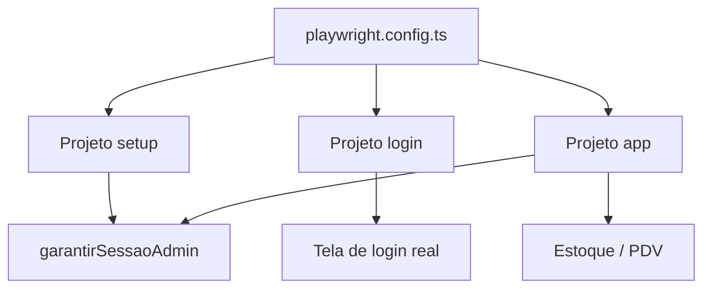

# playwright.config.ts — linha por linha

**Arquivo real:** `farmacia-web/playwright.config.ts`  
**Função:** “Central de comando” — diz ao Playwright **onde** estão os testes, **como** rodar e **o que** subir antes.

---

## Imports e caminhos (linhas 1–13)

| Linha | Código | Explicação |
|-------|--------|------------|
| 1 | `import { defineConfig, devices } from '@playwright/test'` | `defineConfig` monta a config; `devices` traz perfis de navegador (Chrome, Firefox…). |
| 2 | `import path from 'path'` | Utilitário Node para juntar pastas (`join`, `resolve`). |
| 3 | `import { fileURLToPath } from 'url'` | Em projetos ES modules, converte URL do arquivo em caminho no disco. |
| 4 | (vazia) | — |
| 5 | `const __dirname = path.dirname(fileURLToPath(import.meta.url))` | Descobre a pasta onde está este `.ts` (equivalente ao `__dirname` antigo). |
| 6 | `const repoRoot = path.resolve(__dirname, '..')` | Sobe um nível: de `farmacia-web` para a raiz do monorepo. |
| 7 | (vazia) | — |
| 8 | `baseURL = process.env.PLAYWRIGHT_BASE_URL ?? 'http://localhost:5173'` | URL do front (Vite). `??` = usa env se existir, senão padrão. |
| 9 | `apiBase = ... 'http://127.0.0.1:8080'` | URL da API Spring. `127.0.0.1` evita `ECONNREFUSED` com `localhost` no Windows. |
| 10 | `apiHealthUrl = ... /actuator/health` | Endpoint que o Playwright consulta para saber se a API já subiu. |
| 11 | `managedServers = CI === 'true' \|\| PLAYWRIGHT_MANAGED_SERVERS === '1'` | Se `true`, o Playwright **liga** API + Vite sozinho. Localmente você costuma subir manualmente. |
| 12 | (vazia) | — |
| 13 | `apiJar = path.join(repoRoot, 'farmacia-api', 'target', ...)` | Caminho do JAR compilado da API (usado no CI). |

---

## Bloco `defineConfig` (linhas 15–68)

| Linha | Opção | O que significa para QA |
|-------|-------|-------------------------|
| 15 | `export default defineConfig({` | Exporta a config que o CLI do Playwright lê. |
| 16 | `testDir: './e2e'` | Todos os `*.spec.ts` e `auth.setup.ts` ficam em `e2e/`. |
| 17 | `fullyParallel: true` | Testes **diferentes** podem rodar em paralelo (mais rápido). |
| 18 | `forbidOnly: !!process.env.CI` | No CI, falha se alguém deixou `test.only` (evita pular testes no pipeline). |
| 19 | `retries: CI ? 2 : 0` | No CI, repete até 2 vezes teste que falhou (flaky). Local: zero retry. |
| 20 | `workers: CI ? 1 : undefined` | No CI, 1 worker (menos concorrência). Local: padrão do Playwright. |
| 21 | `timeout: 60_000` | Cada teste tem até **60 segundos** para terminar. |
| 22 | `expect: { timeout: 10_000 }` | Cada `expect(...)` espera até **10 s** antes de falhar. |
| 23–26 | `reporter` | `list` = texto no terminal; `html` = relatório em `playwright-report/`. |
| 27–32 | `use: { ... }` | Padrão para **todos** os projetos: `baseURL`, trace, screenshot, vídeo. |
| 28 | `baseURL` | `page.goto('/login')` vira `http://localhost:5173/login`. |
| 29 | `trace: 'on-first-retry'` | Grava trace só na 2ª tentativa (útil para debug no CI). |
| 30 | `screenshot: 'only-on-failure'` | Print só quando o teste quebra. |
| 31 | `video: 'retain-on-failure'` | Vídeo só em falha (economiza disco). |

---

## Projetos (linhas 33–49)

Playwright divide os testes em **projetos** (como “suites” com regras diferentes):

| Projeto | `testMatch` | Dependências | Papel |
|---------|-------------|--------------|-------|
| **setup** | `auth.setup.ts` | — | Roda primeiro: valida API + sessão |
| **login** | `login.spec.ts` | — | Testes da tela de login (independente) |
| **app** | `app.spec.ts` | `setup` | Só roda **depois** do setup passar |

| Linha | Detalhe |
|-------|---------|
| 41 | `devices['Desktop Chrome']` | Emula Chrome desktop (viewport padrão). |
| 46 | `dependencies: ['setup']` | Se setup falhar, `app` nem executa — economiza tempo e deixa o erro claro. |

---

## `webServer` (linhas 50–67)

Só existe quando `managedServers` é `true`:

| Servidor | Comando | URL de espera |
|----------|---------|-----------------|
| API | `java -jar ... --spring.profiles.active=dev` | `actuator/health` |
| Front | `npm run dev` | `baseURL` (5173) |

| Opção | Significado |
|-------|-------------|
| `timeout: 180_000` (API) | Até 3 min para o JAR subir (Maven build pode ser lento). |
| `reuseExistingServer: !CI` | Local: se API/Vite já estão rodando, **reusa** em vez de subir de novo. |
| `undefined` (sem managed) | Você sobe Docker/API/Vite manualmente — comum no dia a dia. |

---

## Diagrama

---

## Perguntas frequentes

**Por que três projetos e não um só?**  
Login precisa rodar **sem** estar logado. App precisa **estar** logado. Setup garante que a infra está OK antes do `app`.

**O que é `baseURL`?**  
Atalho: você escreve `/estoque` e o Playwright completa com `http://localhost:5173/estoque`.

**Por que meu teste falha com ECONNREFUSED?**  
API ou Vite não estão no ar — ou `PLAYWRIGHT_API_URL` aponta para porta errada.
